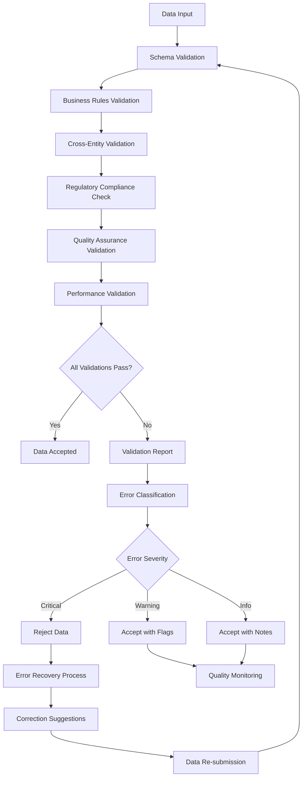
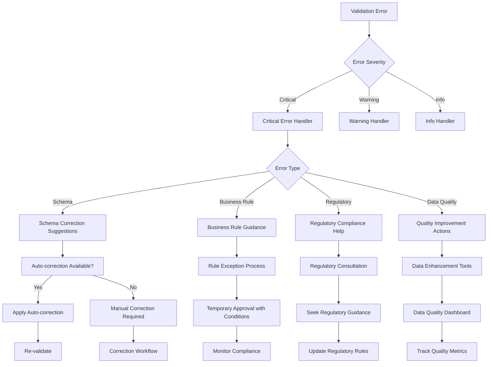

# SKIN-TWIN Validation Framework

This document defines the comprehensive validation framework for ensuring data quality, consistency, and reliability across the SKIN-TWIN hypergraph ecosystem.

## Overview

The SKIN-TWIN validation framework provides multi-layer validation systems, quality assurance protocols, error handling mechanisms, and recovery strategies to maintain the integrity of cosmetic formulation data and relationships.

## Validation Architecture

### Multi-Layer Validation System



### Validation Layers

```typescript
interface ValidationLayer {
  name: string;
  order: number;
  validator: (data: any, context: ValidationContext) => Promise<ValidationResult>;
  required: boolean;
  dependencies?: string[];
}

class ValidationFramework {
  private layers: ValidationLayer[] = [
    {
      name: 'Schema Validation',
      order: 1,
      validator: this.validateSchema,
      required: true
    },
    {
      name: 'Business Rules',
      order: 2,
      validator: this.validateBusinessRules,
      required: true,
      dependencies: ['Schema Validation']
    },
    {
      name: 'Cross-Entity Consistency',
      order: 3,
      validator: this.validateCrossEntity,
      required: true,
      dependencies: ['Business Rules']
    },
    {
      name: 'Regulatory Compliance',
      order: 4,
      validator: this.validateRegulatory,
      required: false
    },
    {
      name: 'Quality Assurance',
      order: 5,
      validator: this.validateQuality,
      required: false,
      dependencies: ['Cross-Entity Consistency']
    },
    {
      name: 'Performance Optimization',
      order: 6,
      validator: this.validatePerformance,
      required: false
    }
  ];
  
  async validate<T>(
    entityType: EntityType,
    data: T,
    context: ValidationContext
  ): Promise<ValidationReport> {
    const results: LayerResult[] = [];
    const startTime = Date.now();
    
    for (const layer of this.layers.sort((a, b) => a.order - b.order)) {
      // Check dependencies
      if (layer.dependencies && !this.dependenciesSatisfied(layer.dependencies, results)) {
        results.push({
          layer: layer.name,
          status: 'skipped',
          reason: 'Dependencies not met'
        });
        continue;
      }
      
      try {
        const layerStart = Date.now();
        const result = await layer.validator(data, context);
        const duration = Date.now() - layerStart;
        
        results.push({
          layer: layer.name,
          status: result.passed ? 'passed' : 'failed',
          result,
          duration
        });
        
        // Stop on critical failures in required layers
        if (layer.required && !result.passed && result.severity === 'critical') {
          break;
        }
        
      } catch (error) {
        results.push({
          layer: layer.name,
          status: 'error',
          error: error.message,
          duration: Date.now() - layerStart
        });
        
        if (layer.required) {
          break;
        }
      }
    }
    
    return this.generateReport(entityType, data, results, Date.now() - startTime);
  }
}
```

## Schema Validation

### Dynamic Schema Validation

```typescript
class SchemaValidator {
  private schemas: Map<EntityType, JSONSchema> = new Map();
  private ajv: Ajv;
  
  constructor() {
    this.ajv = new Ajv({
      allErrors: true,
      verbose: true,
      strict: false,
      addUsedSchema: false
    });
    
    this.loadSchemas();
    this.setupCustomValidators();
  }
  
  private setupCustomValidators() {
    // Custom validator for INCI names
    this.ajv.addKeyword({
      keyword: 'inci',
      type: 'string',
      compile: () => (data: string) => {
        return /^[A-Z][a-z]+((\s|\/)[A-Z][a-z]+)*$/.test(data);
      }
    });
    
    // Custom validator for concentration ranges
    this.ajv.addKeyword({
      keyword: 'concentration',
      type: 'number',
      compile: (schema: any) => (data: number) => {
        return data >= 0 && data <= 100;
      }
    });
    
    // Custom validator for molecular formulas
    this.ajv.addKeyword({
      keyword: 'molecularFormula',
      type: 'string',
      compile: () => (data: string) => {
        const formula = /^([A-Z][a-z]?\d*)+$/;
        return formula.test(data);
      }
    });
    
    // Custom validator for CAS numbers
    this.ajv.addKeyword({
      keyword: 'cas',
      type: 'string',
      compile: () => (data: string) => {
        const casPattern = /^\d{2,7}-\d{2}-\d$/;
        if (!casPattern.test(data)) return false;
        
        // Check CAS checksum
        const digits = data.replace(/-/g, '');
        const checksum = digits.slice(-1);
        const number = digits.slice(0, -1);
        
        let sum = 0;
        for (let i = 0; i < number.length; i++) {
          sum += parseInt(number[i]) * (number.length - i);
        }
        
        return (sum % 10).toString() === checksum;
      }
    });
  }
  
  async validateSchema<T>(
    entityType: EntityType,
    data: T,
    context: ValidationContext
  ): Promise<ValidationResult> {
    const schema = this.schemas.get(entityType);
    if (!schema) {
      return {
        passed: false,
        severity: 'critical',
        errors: [`No schema found for entity type: ${entityType}`]
      };
    }
    
    const validator = this.ajv.compile(schema);
    const valid = validator(data);
    
    if (valid) {
      return { passed: true, severity: 'info' };
    }
    
    const errors = validator.errors?.map(error => {
      return {
        field: error.instancePath || error.dataPath,
        message: error.message,
        value: error.data,
        constraint: error.params
      };
    }) || [];
    
    return {
      passed: false,
      severity: this.categorizeSeverity(errors),
      errors: errors.map(e => `${e.field}: ${e.message}`),
      details: errors
    };
  }
  
  private categorizeSeverity(errors: any[]): Severity {
    const criticalFields = ['id', 'inci', 'molecularFormula', 'cas'];
    const hasCriticalError = errors.some(error => 
      criticalFields.some(field => error.field.includes(field))
    );
    
    return hasCriticalError ? 'critical' : 'warning';
  }
}
```

## Business Rules Validation

### Formulation-Specific Business Rules

```typescript
class FormulationBusinessRules {
  async validateBusinessRules(
    formulation: FormulationSchema,
    context: ValidationContext
  ): Promise<ValidationResult> {
    const rules = [
      this.validateTotalConcentration,
      this.validatePhaseBalance,
      this.validateIncompatibilities,
      this.validateConcentrationRanges,
      this.validatepHCompatibility,
      this.validateStabilityRequirements
    ];
    
    const results = await Promise.all(
      rules.map(rule => rule.call(this, formulation, context))
    );
    
    const errors = results.flatMap(r => r.errors || []);
    const warnings = results.flatMap(r => r.warnings || []);
    
    return {
      passed: errors.length === 0,
      severity: errors.length > 0 ? 'critical' : warnings.length > 0 ? 'warning' : 'info',
      errors,
      warnings
    };
  }
  
  private async validateTotalConcentration(
    formulation: FormulationSchema,
    context: ValidationContext
  ): Promise<RuleResult> {
    const totalConcentration = formulation.ingredients.reduce(
      (sum, ingredient) => sum + ingredient.concentration, 0
    );
    
    const tolerance = 0.1; // 0.1% tolerance
    const errors: string[] = [];
    
    if (Math.abs(totalConcentration - 100) > tolerance) {
      errors.push(
        `Total concentration is ${totalConcentration.toFixed(2)}%, must equal 100% (±${tolerance}%)`
      );
    }
    
    return { errors };
  }
  
  private async validateIncompatibilities(
    formulation: FormulationSchema,
    context: ValidationContext
  ): Promise<RuleResult> {
    const errors: string[] = [];
    const warnings: string[] = [];
    
    // Load incompatibility matrix
    const incompatibilities = await this.getIncompatibilityMatrix();
    
    for (let i = 0; i < formulation.ingredients.length; i++) {
      for (let j = i + 1; j < formulation.ingredients.length; j++) {
        const ing1 = formulation.ingredients[i];
        const ing2 = formulation.ingredients[j];
        
        const incompatibility = incompatibilities.find(inc => 
          (inc.ingredient1 === ing1.ingredientId && inc.ingredient2 === ing2.ingredientId) ||
          (inc.ingredient1 === ing2.ingredientId && inc.ingredient2 === ing1.ingredientId)
        );
        
        if (incompatibility) {
          const message = `Incompatible ingredients: ${ing1.ingredientId} and ${ing2.ingredientId} - ${incompatibility.reason}`;
          
          if (incompatibility.severity === 'critical') {
            errors.push(message);
          } else {
            warnings.push(message);
          }
        }
      }
    }
    
    return { errors, warnings };
  }
  
  private async validatepHCompatibility(
    formulation: FormulationSchema,
    context: ValidationContext
  ): Promise<RuleResult> {
    const errors: string[] = [];
    const warnings: string[] = [];
    
    // Check pH-sensitive ingredients
    for (const ingredient of formulation.ingredients) {
      const ingredientData = await context.getIngredient(ingredient.ingredientId);
      
      if (ingredientData.pH?.sensitivity && formulation.properties?.physicochemical?.pH) {
        const formulationpH = formulation.properties.physicochemical.pH;
        const stability = ingredientData.pH.stability;
        
        if (formulationpH < stability.min || formulationpH > stability.max) {
          const message = `${ingredient.ingredientId} unstable at pH ${formulationpH} (stable range: ${stability.min}-${stability.max})`;
          
          if (ingredientData.pH.severity === 'critical') {
            errors.push(message);
          } else {
            warnings.push(message);
          }
        }
      }
    }
    
    return { errors, warnings };
  }
}
```

### Ingredient-Specific Business Rules

```typescript
class IngredientBusinessRules {
  async validateBusinessRules(
    ingredient: IngredientSchema,
    context: ValidationContext
  ): Promise<ValidationResult> {
    const rules = [
      this.validateMolecularConsistency,
      this.validateSafetyThresholds,
      this.validateRegulatoryCompliance,
      this.validateSolubilityData,
      this.validateConcentrationLimits
    ];
    
    const results = await Promise.all(
      rules.map(rule => rule.call(this, ingredient, context))
    );
    
    const errors = results.flatMap(r => r.errors || []);
    const warnings = results.flatMap(r => r.warnings || []);
    
    return {
      passed: errors.length === 0,
      severity: errors.length > 0 ? 'critical' : warnings.length > 0 ? 'warning' : 'info',
      errors,
      warnings
    };
  }
  
  private async validateMolecularConsistency(
    ingredient: IngredientSchema,
    context: ValidationContext
  ): Promise<RuleResult> {
    const errors: string[] = [];
    const { chemistry, molecular } = ingredient;
    
    // Validate molecular weight consistency
    if (chemistry.molecularFormula && chemistry.molecularWeight) {
      const calculatedMW = this.calculateMolecularWeight(chemistry.molecularFormula);
      const tolerance = chemistry.molecularWeight * 0.02; // 2% tolerance
      
      if (Math.abs(calculatedMW - chemistry.molecularWeight) > tolerance) {
        errors.push(
          `Molecular weight inconsistency: calculated ${calculatedMW.toFixed(2)}, ` +
          `provided ${chemistry.molecularWeight}, tolerance ±${tolerance.toFixed(2)}`
        );
      }
    }
    
    // Validate LogP reasonableness
    if (molecular.logP !== undefined) {
      if (molecular.logP < -5 || molecular.logP > 10) {
        errors.push(`LogP value ${molecular.logP} is outside reasonable range (-5 to 10)`);
      }
    }
    
    return { errors };
  }
  
  private async validateSafetyThresholds(
    ingredient: IngredientSchema,
    context: ValidationContext
  ): Promise<RuleResult> {
    const errors: string[] = [];
    const warnings: string[] = [];
    
    const { usage, safety } = ingredient;
    
    // Check if maximum concentration exceeds safety limits
    if (safety.restrictions?.maximumConcentration) {
      const safetyMax = safety.restrictions.maximumConcentration;
      
      if (usage.maximumConcentration > safetyMax) {
        errors.push(
          `Maximum usage concentration (${usage.maximumConcentration}%) exceeds safety limit (${safetyMax}%)`
        );
      }
      
      if (usage.recommendedConcentration.max > safetyMax) {
        warnings.push(
          `Recommended maximum concentration (${usage.recommendedConcentration.max}%) exceeds safety limit (${safetyMax}%)`
        );
      }
    }
    
    // Check for missing safety data on high-concentration ingredients
    if (usage.maximumConcentration > 10 && !safety.toxicology?.chronicToxicity) {
      warnings.push(
        `High-concentration ingredient (${usage.maximumConcentration}%) missing chronic toxicity data`
      );
    }
    
    return { errors, warnings };
  }
}
```

## Cross-Entity Validation

### Relationship Consistency Validation

```typescript
class CrossEntityValidator {
  async validateCrossEntity(
    entityType: EntityType,
    data: any,
    context: ValidationContext
  ): Promise<ValidationResult> {
    const validators = this.getValidatorsForEntity(entityType);
    
    const results = await Promise.all(
      validators.map(validator => validator(data, context))
    );
    
    const errors = results.flatMap(r => r.errors || []);
    const warnings = results.flatMap(r => r.warnings || []);
    
    return {
      passed: errors.length === 0,
      severity: errors.length > 0 ? 'critical' : warnings.length > 0 ? 'warning' : 'info',
      errors,
      warnings
    };
  }
  
  private async validateFormulationIngredientConsistency(
    formulation: FormulationSchema,
    context: ValidationContext
  ): Promise<RuleResult> {
    const errors: string[] = [];
    const warnings: string[] = [];
    
    // Validate ingredient references exist
    for (const usage of formulation.ingredients) {
      const ingredient = await context.getIngredient(usage.ingredientId);
      
      if (!ingredient) {
        errors.push(`Referenced ingredient not found: ${usage.ingredientId}`);
        continue;
      }
      
      // Validate concentration within ingredient limits
      if (usage.concentration > ingredient.usage.maximumConcentration) {
        errors.push(
          `Concentration ${usage.concentration}% exceeds maximum for ${ingredient.inci} (${ingredient.usage.maximumConcentration}%)`
        );
      }
      
      if (usage.concentration < ingredient.usage.minimumEffectiveConcentration) {
        warnings.push(
          `Concentration ${usage.concentration}% below minimum effective for ${ingredient.inci} (${ingredient.usage.minimumEffectiveConcentration}%)`
        );
      }
      
      // Validate functional consistency
      if (!ingredient.functions.includes(usage.function)) {
        warnings.push(
          `Function '${usage.function}' not listed for ${ingredient.inci}. Available: ${ingredient.functions.join(', ')}`
        );
      }
    }
    
    return { errors, warnings };
  }
  
  private async validateProductFormulationConsistency(
    product: ProductSchema,
    context: ValidationContext
  ): Promise<RuleResult> {
    const errors: string[] = [];
    const warnings: string[] = [];
    
    const formulation = await context.getFormulation(product.formulationId);
    
    if (!formulation) {
      errors.push(`Referenced formulation not found: ${product.formulationId}`);
      return { errors };
    }
    
    // Validate product claims against formulation capabilities
    for (const claim of product.claims) {
      const supported = await this.isClaimSupportedByFormulation(claim, formulation);
      
      if (!supported.isSupported) {
        if (supported.severity === 'critical') {
          errors.push(`Claim '${claim.claim}' not supported by formulation: ${supported.reason}`);
        } else {
          warnings.push(`Claim '${claim.claim}' weakly supported: ${supported.reason}`);
        }
      }
    }
    
    // Validate category consistency
    if (product.category !== formulation.type && !this.isCompatibleCategory(product.category, formulation.type)) {
      warnings.push(
        `Product category '${product.category}' may not match formulation type '${formulation.type}'`
      );
    }
    
    return { errors, warnings };
  }
  
  private async validateSupplierIngredientAvailability(
    formulation: FormulationSchema,
    context: ValidationContext
  ): Promise<RuleResult> {
    const errors: string[] = [];
    const warnings: string[] = [];
    
    for (const usage of formulation.ingredients) {
      const suppliers = await context.getSuppliersForIngredient(usage.ingredientId);
      
      if (suppliers.length === 0) {
        errors.push(`No suppliers found for ingredient: ${usage.ingredientId}`);
        continue;
      }
      
      // Check if any supplier can meet the required specifications
      const availableSuppliers = suppliers.filter(supplier => 
        this.canSupplierMeetRequirements(supplier, usage)
      );
      
      if (availableSuppliers.length === 0) {
        errors.push(`No suppliers can meet requirements for ${usage.ingredientId} at ${usage.concentration}%`);
      } else if (availableSuppliers.length === 1) {
        warnings.push(`Only one supplier available for ${usage.ingredientId} - supply chain risk`);
      }
    }
    
    return { errors, warnings };
  }
}
```

## Regulatory Compliance Validation

### Multi-Region Regulatory Validation

```typescript
class RegulatoryValidator {
  private regulations: Map<Region, RegulationSet> = new Map();
  
  async validateRegulatory(
    entityType: EntityType,
    data: any,
    context: ValidationContext
  ): Promise<ValidationResult> {
    const targetRegions = context.targetRegions || ['US', 'EU', 'ASIA'];
    const results: RegionalResult[] = [];
    
    for (const region of targetRegions) {
      const regulation = this.regulations.get(region);
      if (!regulation) continue;
      
      const result = await this.validateForRegion(entityType, data, region, regulation);
      results.push({ region, ...result });
    }
    
    const criticalIssues = results.filter(r => r.severity === 'critical');
    const warnings = results.filter(r => r.severity === 'warning');
    
    return {
      passed: criticalIssues.length === 0,
      severity: criticalIssues.length > 0 ? 'critical' : warnings.length > 0 ? 'warning' : 'info',
      errors: criticalIssues.flatMap(r => r.errors || []),
      warnings: warnings.flatMap(r => r.warnings || []),
      details: results
    };
  }
  
  private async validateIngredientRegulatory(
    ingredient: IngredientSchema,
    region: Region,
    regulation: RegulationSet
  ): Promise<RuleResult> {
    const errors: string[] = [];
    const warnings: string[] = [];
    
    // Check if ingredient is banned
    if (regulation.bannedSubstances.includes(ingredient.cas || ingredient.inci)) {
      errors.push(`Ingredient ${ingredient.inci} is banned in ${region}`);
      return { errors };
    }
    
    // Check concentration restrictions
    const restriction = regulation.concentrationLimits.find(
      limit => limit.substance === ingredient.cas || limit.substance === ingredient.inci
    );
    
    if (restriction) {
      if (ingredient.usage.maximumConcentration > restriction.maximum) {
        errors.push(
          `Maximum concentration for ${ingredient.inci} in ${region} is ${restriction.maximum}%, ` +
          `but ingredient allows ${ingredient.usage.maximumConcentration}%`
        );
      }
      
      if (restriction.requiresNotification && !ingredient.regulatory.notifications.some(n => n.region === region)) {
        warnings.push(`Ingredient ${ingredient.inci} requires notification in ${region}`);
      }
    }
    
    // Check required safety data
    for (const requirement of regulation.safetyDataRequirements) {
      if (!this.hasSafetyData(ingredient, requirement)) {
        if (requirement.mandatory) {
          errors.push(`Missing required safety data for ${region}: ${requirement.type}`);
        } else {
          warnings.push(`Recommended safety data missing for ${region}: ${requirement.type}`);
        }
      }
    }
    
    return { errors, warnings };
  }
  
  private async validateProductClaimsRegulatory(
    product: ProductSchema,
    region: Region,
    regulation: RegulationSet
  ): Promise<RuleResult> {
    const errors: string[] = [];
    const warnings: string[] = [];
    
    for (const claim of product.claims) {
      const claimRegulation = regulation.claimRequirements.find(
        req => req.claimType === claim.type
      );
      
      if (!claimRegulation) continue;
      
      // Check if claim requires substantiation
      if (claimRegulation.requiresSubstantiation && !claim.substantiation) {
        errors.push(`Claim '${claim.claim}' requires substantiation in ${region}`);
      }
      
      // Check substantiation quality
      if (claim.substantiation && claimRegulation.substantiationRequirements) {
        const meetsCriteria = this.validateSubstantiation(
          claim.substantiation,
          claimRegulation.substantiationRequirements
        );
        
        if (!meetsCriteria.valid) {
          warnings.push(
            `Claim substantiation for '${claim.claim}' may not meet ${region} requirements: ${meetsCriteria.issues.join(', ')}`
          );
        }
      }
      
      // Check prohibited terms
      for (const prohibitedTerm of regulation.prohibitedClaimTerms) {
        if (claim.claim.toLowerCase().includes(prohibitedTerm.toLowerCase())) {
          errors.push(`Claim contains prohibited term '${prohibitedTerm}' for ${region}`);
        }
      }
    }
    
    return { errors, warnings };
  }
}
```

## Quality Assurance Framework

### Automated Quality Scoring

```typescript
class QualityAssuranceValidator {
  private qualityMetrics: QualityMetric[] = [
    {
      name: 'Data Completeness',
      weight: 0.25,
      calculator: this.calculateCompletenessScore
    },
    {
      name: 'Data Accuracy',
      weight: 0.25,
      calculator: this.calculateAccuracyScore
    },
    {
      name: 'Consistency',
      weight: 0.20,
      calculator: this.calculateConsistencyScore
    },
    {
      name: 'Timeliness',
      weight: 0.15,
      calculator: this.calculateTimelinessScore
    },
    {
      name: 'Reliability',
      weight: 0.15,
      calculator: this.calculateReliabilityScore
    }
  ];
  
  async validateQuality(
    entityType: EntityType,
    data: any,
    context: ValidationContext
  ): Promise<ValidationResult> {
    const scores: QualityScore[] = [];
    
    for (const metric of this.qualityMetrics) {
      try {
        const score = await metric.calculator.call(this, data, context);
        scores.push({
          metric: metric.name,
          score,
          weight: metric.weight,
          weightedScore: score * metric.weight
        });
      } catch (error) {
        scores.push({
          metric: metric.name,
          score: 0,
          weight: metric.weight,
          weightedScore: 0,
          error: error.message
        });
      }
    }
    
    const overallScore = scores.reduce((sum, s) => sum + s.weightedScore, 0);
    const grade = this.calculateQualityGrade(overallScore);
    
    const warnings: string[] = [];
    const lowScores = scores.filter(s => s.score < 0.6);
    
    for (const lowScore of lowScores) {
      warnings.push(`Low ${lowScore.metric} score: ${(lowScore.score * 100).toFixed(1)}%`);
    }
    
    return {
      passed: overallScore >= 0.6, // 60% threshold
      severity: overallScore >= 0.8 ? 'info' : overallScore >= 0.6 ? 'warning' : 'critical',
      warnings,
      qualityScore: overallScore,
      qualityGrade: grade,
      metrics: scores
    };
  }
  
  private async calculateCompletenessScore(
    data: any,
    context: ValidationContext
  ): Promise<number> {
    const schema = context.getSchema(context.entityType);
    const requiredFields = this.extractRequiredFields(schema);
    const optionalFields = this.extractOptionalFields(schema);
    
    let score = 0;
    let maxScore = 0;
    
    // Required fields (critical for completeness)
    for (const field of requiredFields) {
      maxScore += 2; // Higher weight for required fields
      if (this.hasValue(data, field)) {
        score += 2;
      }
    }
    
    // Optional fields (enhance completeness)
    for (const field of optionalFields) {
      maxScore += 1;
      if (this.hasValue(data, field)) {
        score += 1;
      }
    }
    
    return maxScore > 0 ? score / maxScore : 1;
  }
  
  private async calculateAccuracyScore(
    data: any,
    context: ValidationContext
  ): Promise<number> {
    let totalChecks = 0;
    let passedChecks = 0;
    
    // Molecular weight accuracy for ingredients
    if (context.entityType === 'ingredient' && data.chemistry) {
      totalChecks++;
      const calculated = this.calculateMolecularWeight(data.chemistry.molecularFormula);
      const tolerance = data.chemistry.molecularWeight * 0.01; // 1% tolerance
      
      if (Math.abs(calculated - data.chemistry.molecularWeight) <= tolerance) {
        passedChecks++;
      }
    }
    
    // Concentration accuracy for formulations
    if (context.entityType === 'formulation' && data.ingredients) {
      totalChecks++;
      const total = data.ingredients.reduce((sum, ing) => sum + ing.concentration, 0);
      
      if (Math.abs(total - 100) <= 0.1) {
        passedChecks++;
      }
    }
    
    // Cross-reference accuracy
    if (data.references) {
      for (const ref of data.references) {
        totalChecks++;
        const exists = await context.checkEntityExists(ref.type, ref.id);
        if (exists) {
          passedChecks++;
        }
      }
    }
    
    return totalChecks > 0 ? passedChecks / totalChecks : 1;
  }
  
  private async calculateConsistencyScore(
    data: any,
    context: ValidationContext
  ): Promise<number> {
    let score = 1;
    const penalties: number[] = [];
    
    // Internal consistency checks
    if (context.entityType === 'formulation') {
      // Phase-ingredient consistency
      for (const ingredient of data.ingredients) {
        const phase = data.phases.find(p => p.id === ingredient.phase);
        if (!phase) {
          penalties.push(0.1); // 10% penalty for orphaned ingredient
        } else if (!phase.ingredients.includes(ingredient.ingredientId)) {
          penalties.push(0.05); // 5% penalty for inconsistent phase assignment
        }
      }
    }
    
    // External consistency with related entities
    if (data.relatedEntities) {
      for (const related of data.relatedEntities) {
        const entity = await context.getEntity(related.type, related.id);
        if (entity) {
          const consistent = await this.checkRelationshipConsistency(data, entity, related.relationship);
          if (!consistent) {
            penalties.push(0.1);
          }
        }
      }
    }
    
    // Apply penalties
    const totalPenalty = penalties.reduce((sum, penalty) => sum + penalty, 0);
    score = Math.max(0, score - totalPenalty);
    
    return score;
  }
}
```

## Error Handling and Recovery

### Error Classification and Recovery



### Recovery Strategies

```typescript
class ValidationErrorHandler {
  async handleValidationErrors(
    errors: ValidationError[],
    context: ValidationContext
  ): Promise<RecoveryPlan> {
    const recoveryActions: RecoveryAction[] = [];
    
    for (const error of errors) {
      const action = await this.determineRecoveryAction(error, context);
      recoveryActions.push(action);
    }
    
    return {
      actions: recoveryActions,
      canAutoRecover: recoveryActions.every(a => a.autoRecoverable),
      estimatedEffort: this.calculateRecoveryEffort(recoveryActions),
      priority: this.calculatePriority(errors)
    };
  }
  
  private async determineRecoveryAction(
    error: ValidationError,
    context: ValidationContext
  ): Promise<RecoveryAction> {
    
    switch (error.category) {
      case 'schema':
        return this.handleSchemaError(error, context);
      
      case 'business_rule':
        return this.handleBusinessRuleError(error, context);
      
      case 'regulatory':
        return this.handleRegulatoryError(error, context);
      
      case 'quality':
        return this.handleQualityError(error, context);
      
      default:
        return {
          type: 'manual_review',
          description: 'Manual review required',
          autoRecoverable: false,
          effort: 'high'
        };
    }
  }
  
  private async handleSchemaError(
    error: ValidationError,
    context: ValidationContext
  ): Promise<RecoveryAction> {
    
    // Auto-correction for common schema issues
    if (error.field === 'molecularWeight' && error.data.molecularFormula) {
      const corrected = this.calculateMolecularWeight(error.data.molecularFormula);
      
      return {
        type: 'auto_correct',
        description: `Correct molecular weight from ${error.data.molecularWeight} to ${corrected}`,
        autoRecoverable: true,
        effort: 'low',
        correction: {
          field: 'chemistry.molecularWeight',
          value: corrected
        }
      };
    }
    
    // Format corrections
    if (error.type === 'format' && error.field === 'cas') {
      const formatted = this.formatCASNumber(error.data);
      if (formatted) {
        return {
          type: 'auto_correct',
          description: `Format CAS number: ${error.data} → ${formatted}`,
          autoRecoverable: true,
          effort: 'low',
          correction: {
            field: 'cas',
            value: formatted
          }
        };
      }
    }
    
    return {
      type: 'manual_correction',
      description: `Manual correction required for ${error.field}: ${error.message}`,
      autoRecoverable: false,
      effort: 'medium',
      guidance: this.getSchemaGuidance(error)
    };
  }
  
  private async handleBusinessRuleError(
    error: ValidationError,
    context: ValidationContext
  ): Promise<RecoveryAction> {
    
    // Concentration adjustment
    if (error.rule === 'total_concentration') {
      const adjustment = this.calculateConcentrationAdjustment(error.data);
      
      return {
        type: 'adjustment',
        description: `Adjust ingredient concentrations to total 100%`,
        autoRecoverable: true,
        effort: 'medium',
        adjustment
      };
    }
    
    // Incompatibility resolution
    if (error.rule === 'ingredient_incompatibility') {
      const alternatives = await this.findAlternativeIngredients(
        error.data.incompatibleIngredients,
        context
      );
      
      return {
        type: 'substitution',
        description: 'Replace incompatible ingredients with alternatives',
        autoRecoverable: false,
        effort: 'high',
        alternatives
      };
    }
    
    return {
      type: 'rule_exception',
      description: `Business rule exception required: ${error.message}`,
      autoRecoverable: false,
      effort: 'high',
      requiresApproval: true
    };
  }
  
  private async handleRegulatoryError(
    error: ValidationError,
    context: ValidationContext
  ): Promise<RecoveryAction> {
    
    // Concentration reduction for regulatory compliance
    if (error.type === 'concentration_limit') {
      return {
        type: 'concentration_reduction',
        description: `Reduce concentration to comply with ${error.region} regulations`,
        autoRecoverable: true,
        effort: 'medium',
        maxConcentration: error.regulatoryLimit
      };
    }
    
    // Missing documentation
    if (error.type === 'missing_documentation') {
      return {
        type: 'documentation_request',
        description: `Obtain required documentation for ${error.region}`,
        autoRecoverable: false,
        effort: 'high',
        requiredDocuments: error.missingDocuments
      };
    }
    
    return {
      type: 'regulatory_consultation',
      description: 'Consult with regulatory affairs team',
      autoRecoverable: false,
      effort: 'high',
      specialist: 'regulatory_affairs'
    };
  }
}
```

## Performance Monitoring

### Validation Performance Metrics

```typescript
class ValidationMetrics {
  private metrics: Map<string, PerformanceMetric> = new Map();
  
  startValidation(entityType: EntityType, entityId: string): ValidationSession {
    const session = {
      id: generateId(),
      entityType,
      entityId,
      startTime: Date.now(),
      layerTimes: new Map(),
      cacheHits: 0,
      cacheMisses: 0
    };
    
    return session;
  }
  
  recordLayerPerformance(
    session: ValidationSession,
    layer: string,
    duration: number,
    result: ValidationResult
  ): void {
    session.layerTimes.set(layer, {
      duration,
      passed: result.passed,
      errorCount: result.errors?.length || 0
    });
    
    // Update aggregate metrics
    const key = `${session.entityType}:${layer}`;
    const existing = this.metrics.get(key) || {
      totalDuration: 0,
      totalExecutions: 0,
      successRate: 0,
      averageDuration: 0
    };
    
    existing.totalDuration += duration;
    existing.totalExecutions++;
    existing.successRate = (existing.successRate * (existing.totalExecutions - 1) + (result.passed ? 1 : 0)) / existing.totalExecutions;
    existing.averageDuration = existing.totalDuration / existing.totalExecutions;
    
    this.metrics.set(key, existing);
  }
  
  endValidation(session: ValidationSession, overallResult: ValidationResult): ValidationReport {
    const totalDuration = Date.now() - session.startTime;
    
    return {
      sessionId: session.id,
      entityType: session.entityType,
      entityId: session.entityId,
      totalDuration,
      layerPerformance: Array.from(session.layerTimes.entries()),
      cacheEfficiency: session.cacheHits / (session.cacheHits + session.cacheMisses),
      result: overallResult,
      timestamp: new Date()
    };
  }
  
  getPerformanceInsights(): PerformanceInsights {
    const insights = {
      bottlenecks: this.identifyBottlenecks(),
      improvementOpportunities: this.identifyImprovements(),
      trends: this.analyzeTrends(),
      recommendations: this.generateRecommendations()
    };
    
    return insights;
  }
  
  private identifyBottlenecks(): Bottleneck[] {
    const bottlenecks: Bottleneck[] = [];
    
    for (const [key, metric] of this.metrics) {
      if (metric.averageDuration > 1000) { // More than 1 second
        bottlenecks.push({
          layer: key,
          averageDuration: metric.averageDuration,
          severity: metric.averageDuration > 5000 ? 'critical' : 'warning'
        });
      }
    }
    
    return bottlenecks.sort((a, b) => b.averageDuration - a.averageDuration);
  }
}
```

This comprehensive validation framework ensures data quality, regulatory compliance, and system reliability across the SKIN-TWIN ecosystem while providing robust error handling and performance monitoring capabilities.