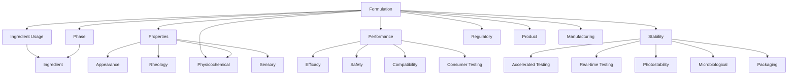
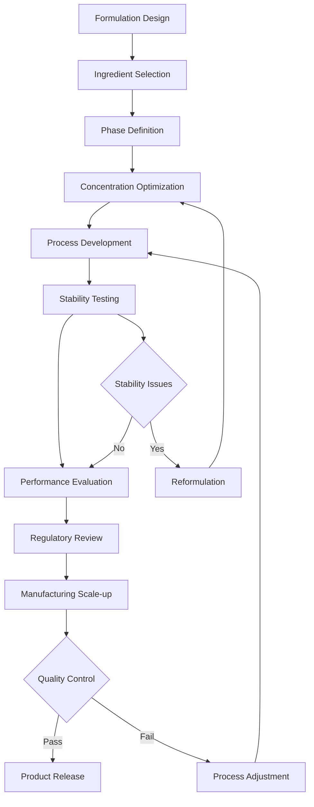

# SKIN-TWIN Formulations Schema Documentation

This document defines the comprehensive schema for cosmetic formulations within the SKIN-TWIN hypergraph architecture.

## Overview

Formulations represent complete cosmetic product recipes with ingredient compositions, processing parameters, and regulatory metadata. They serve as the core entities connecting ingredients, products, and manufacturing processes.

## TypeScript Interface

```typescript
interface FormulationSchema {
  // Core Identity
  id: string;                    // Unique formulation identifier
  name: string;                  // Commercial or development name
  version: string;               // Version number (semantic versioning)
  type: FormulationType;         // Category classification
  
  // Composition
  phases: Phase[];               // Multi-phase structure
  ingredients: IngredientUsage[]; // Ingredient specifications
  totalWeight: number;           // Total formulation weight (grams)
  
  // Properties
  properties: FormulationProperties;
  performance: PerformanceMetrics;
  stability: StabilityData;
  
  // Manufacturing
  process: ProcessingInstructions;
  equipment: EquipmentRequirements;
  qualityControl: QCParameters;
  
  // Regulatory & Compliance
  regulatory: RegulatoryData;
  claims: ProductClaims[];
  restrictions: UsageRestrictions;
  
  // Metadata
  developedBy: string;
  developmentDate: Date;
  lastModified: Date;
  status: FormulationStatus;
  tags: string[];
}

interface Phase {
  id: string;
  name: string;
  type: PhaseType;              // "aqueous" | "oil" | "emulsion" | "powder"
  temperature: TemperatureRange;
  pH?: pHRange;
  ingredients: string[];        // Ingredient IDs in this phase
  processingTime: number;       // Minutes
  mixingSpeed?: number;         // RPM
}

interface IngredientUsage {
  ingredientId: string;
  concentration: number;        // Percentage by weight
  concentrationRange?: {
    min: number;
    max: number;
  };
  function: IngredientFunction; // Primary function in formulation
  phase: string;               // Phase ID where ingredient is added
  additionOrder: number;       // Order of addition
  notes?: string;
}

interface FormulationProperties {
  appearance: {
    color: string;
    clarity: "clear" | "translucent" | "opaque";
    texture: string;
  };
  rheology: {
    viscosity: number;          // cP at 25°C
    flowBehavior: "newtonian" | "shear-thinning" | "shear-thickening";
  };
  physicochemical: {
    pH: number;
    density: number;           // g/mL
    refractionIndex?: number;
  };
  sensory: {
    spreadability: number;     // 1-10 scale
    absorption: number;        // 1-10 scale
    afterfeel: string;
  };
}

interface PerformanceMetrics {
  efficacy: EfficacyData[];
  safety: SafetyProfile;
  compatibility: CompatibilityData;
  consumer: ConsumerTesting;
}

interface StabilityData {
  accelerated: StabilityTest[];
  realTime: StabilityTest[];
  photostability: PhotostabilityData;
  microbiological: MicrobiologicalStability;
  packaging: PackagingCompatibility[];
}

type FormulationType = 
  | "serum" 
  | "cream" 
  | "lotion" 
  | "gel" 
  | "oil" 
  | "balm" 
  | "mask" 
  | "cleanser" 
  | "toner" 
  | "treatment";

type FormulationStatus = 
  | "development" 
  | "testing" 
  | "approved" 
  | "discontinued" 
  | "reformulated";

type IngredientFunction = 
  | "active" 
  | "emulsifier" 
  | "humectant" 
  | "preservative" 
  | "fragrance" 
  | "colorant" 
  | "stabilizer" 
  | "solvent" 
  | "thickener" 
  | "antioxidant";
```

## Schema Relationships



## Validation Rules

### Core Requirements
- `id`: Must be unique across all formulations
- `name`: Required, 3-100 characters
- `version`: Must follow semantic versioning (x.y.z)
- `phases`: Must contain at least one phase
- `ingredients`: Must contain at least one ingredient
- `totalWeight`: Must equal sum of all ingredient weights

### Composition Validation
```typescript
const validateComposition = (formulation: FormulationSchema): ValidationResult => {
  const errors: string[] = [];
  
  // Total concentration check
  const totalConcentration = formulation.ingredients
    .reduce((sum, ing) => sum + ing.concentration, 0);
  
  if (Math.abs(totalConcentration - 100) > 0.1) {
    errors.push('Total ingredient concentration must equal 100%');
  }
  
  // Phase consistency
  formulation.phases.forEach(phase => {
    const phaseIngredients = formulation.ingredients
      .filter(ing => ing.phase === phase.id);
    
    if (phaseIngredients.length === 0) {
      errors.push(`Phase ${phase.name} contains no ingredients`);
    }
  });
  
  // Incompatibility checks
  const incompatiblePairs = checkIncompatibilities(formulation.ingredients);
  errors.push(...incompatiblePairs);
  
  return {
    valid: errors.length === 0,
    errors
  };
};
```

## Processing Workflow



## Integration with SKIN-TWIN Hypergraph

### Node Representation
```typescript
interface FormulationNode {
  id: string;
  type: "formulation";
  data: FormulationSchema;
  metadata: {
    complexity: number;        // Calculated complexity score
    novelty: number;          // Innovation index
    marketPotential: number;  // Commercial viability score
  };
}
```

### Edge Types
- **CONTAINS**: Formulation → Ingredient (with concentration)
- **PRODUCES**: Formulation → Product
- **REQUIRES**: Formulation → Equipment
- **COMPETES_WITH**: Formulation → Formulation
- **DERIVED_FROM**: Formulation → Formulation (versions)
- **TESTED_BY**: Formulation → TestMethod

### Network Queries
```cypher
// Find formulations using specific ingredient
MATCH (f:Formulation)-[c:CONTAINS]->(i:Ingredient {name: "Niacinamide"})
WHERE c.concentration > 2.0
RETURN f, c.concentration

// Find competing formulations
MATCH (f1:Formulation)-[:COMPETES_WITH]-(f2:Formulation)
WHERE f1.type = "anti-aging serum"
RETURN f1, f2

// Formulation development lineage
MATCH path = (f1:Formulation)-[:DERIVED_FROM*]->(f2:Formulation)
WHERE f1.id = "peptide-complex-v3"
RETURN path
```

## Performance Optimization

### Caching Strategy
```typescript
class FormulationCache {
  private cache = new Map<string, FormulationSchema>();
  private ingredientIndex = new Map<string, Set<string>>();
  
  async getFormulation(id: string): Promise<FormulationSchema> {
    if (this.cache.has(id)) {
      return this.cache.get(id)!;
    }
    
    const formulation = await this.fetchFormulation(id);
    this.cache.set(id, formulation);
    this.updateIngredientIndex(formulation);
    
    return formulation;
  }
  
  findByIngredient(ingredientId: string): string[] {
    return Array.from(this.ingredientIndex.get(ingredientId) || []);
  }
}
```

### Batch Processing
```typescript
const optimizeFormulationBatch = async (
  formulations: FormulationSchema[]
): Promise<OptimizationResult[]> => {
  const batches = chunkArray(formulations, 50);
  
  return Promise.all(
    batches.map(batch => 
      processFormulationBatch(batch)
    )
  ).then(results => results.flat());
};
```

## Quality Assurance

### Automated Validation
```typescript
const validateFormulationQuality = (formulation: FormulationSchema): QualityReport => {
  const checks = [
    validateIngredientCompatibility,
    validateStabilityRequirements,
    validateRegulatoryCompliance,
    validatePerformanceClaims,
    validateProcessingFeasibility
  ];
  
  const results = checks.map(check => check(formulation));
  
  return {
    overall: results.every(r => r.passed),
    checks: results,
    recommendations: generateRecommendations(results)
  };
};
```

## Usage Examples

### Creating a New Formulation
```typescript
const newSerum: FormulationSchema = {
  id: "hydrating-serum-v1",
  name: "Ultimate Hydrating Serum",
  version: "1.0.0",
  type: "serum",
  phases: [
    {
      id: "aqueous",
      name: "Aqueous Phase",
      type: "aqueous",
      temperature: { min: 60, max: 70 },
      pH: { min: 5.5, max: 6.5 },
      ingredients: ["water", "glycerin", "niacinamide"],
      processingTime: 15,
      mixingSpeed: 800
    }
  ],
  ingredients: [
    {
      ingredientId: "water",
      concentration: 65.0,
      function: "solvent",
      phase: "aqueous",
      additionOrder: 1
    },
    {
      ingredientId: "glycerin",
      concentration: 15.0,
      function: "humectant",
      phase: "aqueous",
      additionOrder: 2
    },
    {
      ingredientId: "niacinamide",
      concentration: 5.0,
      function: "active",
      phase: "aqueous",
      additionOrder: 3
    }
  ],
  totalWeight: 100.0,
  // ... additional properties
};
```

### Formulation Analysis
```typescript
const analyzeFormulation = async (formulation: FormulationSchema) => {
  const analysis = {
    complexity: calculateComplexity(formulation),
    cost: await calculateCost(formulation),
    stability: predictStability(formulation),
    performance: await simulatePerformance(formulation),
    sustainability: calculateSustainabilityScore(formulation)
  };
  
  return analysis;
};
```

This schema provides a comprehensive framework for representing cosmetic formulations within the SKIN-TWIN ecosystem, enabling sophisticated analysis, optimization, and knowledge discovery across the hypergraph network.