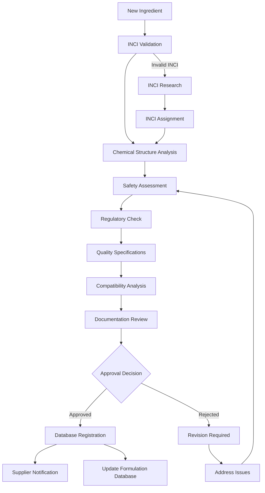
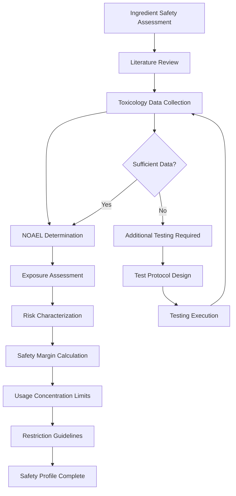

# SKIN-TWIN Ingredients Schema Documentation

This document defines the comprehensive schema for cosmetic ingredients within the SKIN-TWIN hypergraph architecture.

## Overview

Ingredients are the fundamental building blocks of cosmetic formulations. Each ingredient contains detailed chemical, regulatory, and performance data that enables intelligent formulation design and safety assessment.

## TypeScript Interface

```typescript
interface IngredientSchema {
  // Core Identity
  id: string;                    // Unique ingredient identifier
  inci: string;                  // INCI (International Nomenclature) name
  tradeName?: string;            // Commercial trade name
  cas?: string;                  // CAS registry number
  einecs?: string;               // EINECS number
  
  // Chemical Properties
  chemistry: ChemicalProperties;
  molecular: MolecularData;
  physical: PhysicalProperties;
  
  // Functional Properties
  functions: IngredientFunction[];
  benefits: CosmeticBenefit[];
  mechanisms: MechanismOfAction[];
  
  // Usage & Safety
  usage: UsageGuidelines;
  safety: SafetyData;
  regulatory: RegulatoryStatus;
  
  // Quality & Sourcing
  quality: QualitySpecifications;
  sourcing: SourcingData;
  sustainability: SustainabilityData;
  
  // Performance Data
  efficacy: EfficacyStudies[];
  compatibility: CompatibilityData;
  stability: StabilityProfile;
  
  // Metadata
  supplier?: string;
  category: IngredientCategory;
  origin: IngredientOrigin;
  certifications: Certification[];
  lastUpdated: Date;
  version: string;
}

interface ChemicalProperties {
  molecularFormula: string;
  molecularWeight: number;
  structure?: string;             // SMILES or chemical structure
  iupacName?: string;
  synonyms: string[];
  chemicalClass: ChemicalClass;
  functionalGroups: string[];
}

interface MolecularData {
  logP?: number;                  // Lipophilicity
  pKa?: number[];                 // Acid dissociation constants
  solubility: SolubilityData;
  volatility?: number;
  polarity: "polar" | "nonpolar" | "amphiphilic";
}

interface PhysicalProperties {
  appearance: {
    color: string;
    form: PhysicalForm;
    odor?: string;
  };
  melting: {
    point?: number;               // °C
    range?: TemperatureRange;
  };
  boiling: {
    point?: number;               // °C
    pressure?: number;            // mmHg
  };
  density?: number;               // g/mL
  refractionIndex?: number;
  pH?: pHData;
  viscosity?: ViscosityData;
}

interface UsageGuidelines {
  recommendedConcentration: ConcentrationRange;
  maximumConcentration: number;
  minimumEffectiveConcentration: number;
  typicalApplications: ApplicationType[];
  incompatibilities: string[];    // Ingredient IDs to avoid
  synergies: string[];           // Ingredient IDs that enhance performance
  formulation: FormulationGuidance;
}

interface SafetyData {
  toxicology: ToxicologyData;
  irritation: IrritationData;
  sensitization: SensitizationData;
  restrictions: SafetyRestrictions;
  warnings: string[];
  contraindications: string[];
  pregnancySafety: PregnancyCategory;
}

interface RegulatoryStatus {
  regions: RegionStatus[];
  approvals: RegulatoryApproval[];
  restrictions: RegulatoryRestriction[];
  monographs: Monograph[];
  updates: RegulatoryUpdate[];
}

interface QualitySpecifications {
  purity: {
    minimum: number;             // Percentage
    typical: number;
    impurities: ImpurityProfile[];
  };
  assay: AssayMethod[];
  microbiological: MicrobialLimits;
  heavyMetals: HeavyMetalLimits;
  residualSolvents?: SolventLimits;
  storage: StorageConditions;
  shelfLife: number;             // Months
}

type IngredientCategory = 
  | "active" 
  | "emulsifier" 
  | "preservative" 
  | "humectant" 
  | "emollient" 
  | "thickener" 
  | "solvent" 
  | "colorant" 
  | "fragrance" 
  | "antioxidant" 
  | "pH_adjuster" 
  | "chelating_agent";

type IngredientOrigin = 
  | "natural" 
  | "synthetic" 
  | "biotechnology" 
  | "mineral" 
  | "marine";

type PhysicalForm = 
  | "liquid" 
  | "solid" 
  | "powder" 
  | "crystal" 
  | "gel" 
  | "paste" 
  | "wax";

type ApplicationType = 
  | "skincare" 
  | "makeup" 
  | "haircare" 
  | "suncare" 
  | "anti-aging" 
  | "acne" 
  | "sensitive_skin";
```

## Schema Relationships

```mermaid
graph TB
    I[Ingredient] --> C[Chemistry]
    I --> M[Molecular Data]
    I --> P[Physical Properties]
    I --> U[Usage Guidelines]
    I --> S[Safety Data]
    I --> R[Regulatory Status]
    I --> Q[Quality Specs]
    I --> SR[Sourcing]
    I --> E[Efficacy Studies]
    
    C --> MF[Molecular Formula]
    C --> CC[Chemical Class]
    C --> FG[Functional Groups]
    
    M --> Sol[Solubility]
    M --> LogP[Lipophilicity]
    M --> pKa[Acid Constants]
    
    U --> RC[Recommended Concentration]
    U --> Inc[Incompatibilities]
    U --> Syn[Synergies]
    U --> Apps[Applications]
    
    S --> Tox[Toxicology]
    S --> Irr[Irritation]
    S --> Sen[Sensitization]
    S --> Res[Restrictions]
    
    R --> Reg[Regional Status]
    R --> App[Approvals]
    R --> Mon[Monographs]
    
    Q --> Pur[Purity]
    Q --> Assay[Assay Methods]
    Q --> Micro[Microbial Limits]
    Q --> Storage[Storage Conditions]
```



## Validation Framework

### Core Validation Rules
```typescript
const validateIngredient = (ingredient: IngredientSchema): ValidationResult => {
  const errors: string[] = [];
  const warnings: string[] = [];
  
  // INCI name validation
  if (!ingredient.inci || ingredient.inci.length < 3) {
    errors.push('Valid INCI name is required');
  }
  
  // Molecular weight validation
  if (ingredient.chemistry.molecularWeight <= 0) {
    errors.push('Molecular weight must be positive');
  }
  
  // Concentration range validation
  const usage = ingredient.usage;
  if (usage.maximumConcentration < usage.recommendedConcentration.max) {
    errors.push('Maximum concentration cannot be less than recommended maximum');
  }
  
  // Safety validation
  if (usage.maximumConcentration > 50 && !ingredient.safety.restrictions.length) {
    warnings.push('High concentration ingredient should have safety restrictions');
  }
  
  // Regulatory validation
  const hasEuApproval = ingredient.regulatory.regions
    .some(r => r.region === 'EU' && r.status === 'approved');
  if (!hasEuApproval) {
    warnings.push('No EU regulatory approval found');
  }
  
  return {
    valid: errors.length === 0,
    errors,
    warnings
  };
};
```

### Chemical Structure Validation
```typescript
const validateChemicalStructure = (ingredient: IngredientSchema): boolean => {
  const { chemistry, molecular } = ingredient;
  
  // Validate molecular formula consistency
  const calculatedMW = calculateMolecularWeight(chemistry.molecularFormula);
  const tolerance = chemistry.molecularWeight * 0.01; // 1% tolerance
  
  if (Math.abs(calculatedMW - chemistry.molecularWeight) > tolerance) {
    return false;
  }
  
  // Validate SMILES structure if provided
  if (chemistry.structure) {
    return validateSMILES(chemistry.structure);
  }
  
  return true;
};
```

## Processing Workflows

### Ingredient Registration Workflow


### Safety Assessment Workflow


## Integration with SKIN-TWIN Hypergraph

### Node Representation
```typescript
interface IngredientNode {
  id: string;
  type: "ingredient";
  data: IngredientSchema;
  metadata: {
    popularity: number;        // Usage frequency across formulations
    innovationIndex: number;   // Novelty score
    riskScore: number;        // Safety risk assessment
    sustainability: number;    // Environmental impact score
  };
}
```

### Edge Types
- **CONTAINED_IN**: Ingredient → Formulation (with concentration)
- **SUPPLIED_BY**: Ingredient → Supplier
- **COMPETES_WITH**: Ingredient → Ingredient (functional alternatives)
- **SYNERGIZES_WITH**: Ingredient → Ingredient (positive interactions)
- **INCOMPATIBLE_WITH**: Ingredient → Ingredient (negative interactions)
- **DERIVED_FROM**: Ingredient → Ingredient (chemical derivatives)
- **TESTED_BY**: Ingredient → TestMethod

### Advanced Queries
```cypher
// Find ingredients with similar functions
MATCH (i1:Ingredient)-[:COMPETES_WITH]-(i2:Ingredient)
WHERE "anti-aging" IN i1.benefits
RETURN i1, i2

// Find synergistic ingredient combinations
MATCH (i1:Ingredient)-[:SYNERGIZES_WITH]-(i2:Ingredient)
WHERE i1.category = "active" AND i2.category = "active"
RETURN i1.inci, i2.inci, 
       [(i1)-[:CONTAINED_IN]->(f:Formulation)<-[:CONTAINED_IN]-(i2) | f.name] as formulations

// Trace ingredient supply chain
MATCH path = (i:Ingredient)-[:SUPPLIED_BY]->(s:Supplier)-[:SOURCES_FROM*]->(origin)
WHERE i.inci = "Bakuchiol"
RETURN path
```

## Performance Optimization

### Ingredient Search Index
```typescript
class IngredientSearchIndex {
  private fuse: Fuse<IngredientSchema>;
  private categoryIndex = new Map<IngredientCategory, Set<string>>();
  private functionIndex = new Map<IngredientFunction, Set<string>>();
  
  constructor(ingredients: IngredientSchema[]) {
    this.fuse = new Fuse(ingredients, {
      keys: ['inci', 'tradeName', 'chemistry.synonyms', 'functions'],
      threshold: 0.3
    });
    
    this.buildIndices(ingredients);
  }
  
  search(query: string): IngredientSchema[] {
    return this.fuse.search(query).map(result => result.item);
  }
  
  findByCategory(category: IngredientCategory): string[] {
    return Array.from(this.categoryIndex.get(category) || []);
  }
  
  findByFunction(func: IngredientFunction): string[] {
    return Array.from(this.functionIndex.get(func) || []);
  }
}
```

### Batch Processing for Large Datasets
```typescript
const processIngredientBatch = async (
  ingredients: IngredientSchema[]
): Promise<ProcessingResult[]> => {
  const batchSize = 100;
  const batches = chunkArray(ingredients, batchSize);
  
  return Promise.all(
    batches.map(async (batch, index) => {
      console.log(`Processing batch ${index + 1}/${batches.length}`);
      
      return Promise.all(
        batch.map(ingredient => ({
          id: ingredient.id,
          validation: validateIngredient(ingredient),
          safety: assessSafety(ingredient),
          compatibility: analyzeCompatibility(ingredient)
        }))
      );
    })
  ).then(results => results.flat());
};
```

## Quality Assurance

### Automated Quality Checks
```typescript
const performQualityAssurance = (ingredient: IngredientSchema): QualityReport => {
  const checks = [
    checkDataCompleteness,
    validateChemicalConsistency,
    verifyRegulatoryCompliance,
    assessSafetyProfile,
    validateConcentrationRanges,
    checkSourceReliability
  ];
  
  const results = checks.map(check => ({
    name: check.name,
    result: check(ingredient),
    timestamp: new Date()
  }));
  
  return {
    overall: results.every(r => r.result.passed),
    checks: results,
    score: calculateQualityScore(results),
    recommendations: generateQualityRecommendations(results)
  };
};
```

## Usage Examples

### Creating a New Ingredient
```typescript
const newIngredient: IngredientSchema = {
  id: "bakuchiol",
  inci: "Bakuchiol",
  tradeName: "Sytenol A",
  cas: "10309-37-2",
  chemistry: {
    molecularFormula: "C18H24O",
    molecularWeight: 256.38,
    structure: "CC(C)=CCC/C(C)=C/CC1=CC(=C(C=C1)O)C(C)C",
    iupacName: "(S)-1-{4-[(1E,3E)-4-(4-hydroxy-3-(1-methylethyl)phenyl)-1,3-butadienyl]phenyl}ethanone",
    synonyms: ["Psoralea Corylifolia Extract"],
    chemicalClass: "phenolic_compound",
    functionalGroups: ["phenol", "alkene"]
  },
  molecular: {
    logP: 4.2,
    solubility: {
      water: { value: 0.1, unit: "mg/mL", temperature: 25 },
      ethanol: { value: 50, unit: "mg/mL", temperature: 25 },
      oil: { value: 100, unit: "mg/mL", temperature: 25 }
    },
    polarity: "nonpolar"
  },
  functions: ["antioxidant", "anti-aging"],
  benefits: ["wrinkle_reduction", "skin_firmness", "retinol_alternative"],
  usage: {
    recommendedConcentration: { min: 0.5, max: 2.0 },
    maximumConcentration: 2.0,
    minimumEffectiveConcentration: 0.5,
    typicalApplications: ["anti-aging", "skincare"],
    incompatibilities: [],
    synergies: ["vitamin_e", "vitamin_c"]
  },
  category: "active",
  origin: "natural",
  // ... additional properties
};
```

### Ingredient Analysis
```typescript
const analyzeIngredient = async (ingredient: IngredientSchema) => {
  const analysis = {
    safety: await assessSafetyProfile(ingredient),
    efficacy: await evaluateEfficacy(ingredient),
    sustainability: calculateSustainabilityScore(ingredient),
    market: await getMarketAnalysis(ingredient),
    formulations: await findFormulationUsage(ingredient),
    alternatives: await findAlternatives(ingredient)
  };
  
  return analysis;
};

const findOptimalConcentration = (
  ingredient: IngredientSchema,
  formulation: FormulationSchema
): ConcentrationRecommendation => {
  const compatibility = analyzeFormulationCompatibility(ingredient, formulation);
  const efficacy = predictEfficacyAtConcentrations(ingredient);
  const safety = assessSafetyMargins(ingredient, formulation);
  
  return {
    recommended: optimizeConcentration(efficacy, safety, compatibility),
    reasoning: generateRecommendationReasoning(efficacy, safety, compatibility),
    confidence: calculateConfidence(ingredient, formulation)
  };
};
```

This comprehensive schema enables sophisticated ingredient management, safety assessment, and intelligent formulation design within the SKIN-TWIN ecosystem.