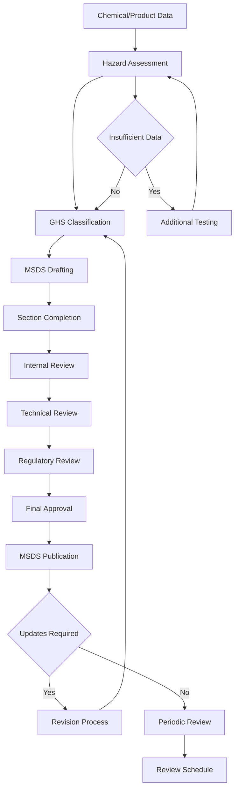

# SKIN-TWIN Material Safety Data Sheet (MSDS) Schema Documentation

This document defines the comprehensive schema for Material Safety Data Sheet (MSDS) documents within the SKIN-TWIN hypergraph architecture, ensuring compliance with GHS (Globally Harmonized System) and CLP (Classification, Labelling and Packaging) regulations.

## Overview

Material Safety Data Sheets (MSDS) are standardized documents that provide critical safety information about chemical substances and mixtures. They contain comprehensive data about physical and chemical properties, health and environmental hazards, safe handling procedures, and emergency measures. MSDS documents are essential for workplace safety, regulatory compliance, and supply chain communication.

## TypeScript Interface

```typescript
interface MSDSSchema {
  // Core Identity
  id: string;                    // Unique MSDS identifier
  documentVersion: string;       // MSDS document version
  revisionDate: Date;           // Last revision date
  supercededDate?: Date;        // Date of superseded version
  status: MSDSStatus;           // Document status
  
  // Section 1: Identification
  identification: ProductIdentification;
  
  // Section 2: Hazard Identification
  hazardIdentification: HazardIdentification;
  
  // Section 3: Composition/Information on Ingredients
  composition: CompositionInformation;
  
  // Section 4: First Aid Measures
  firstAidMeasures: FirstAidMeasures;
  
  // Section 5: Fire-fighting Measures
  firefightingMeasures: FirefightingMeasures;
  
  // Section 6: Accidental Release Measures
  accidentalRelease: AccidentalReleaseMeasures;
  
  // Section 7: Handling and Storage
  handlingStorage: HandlingStorageInfo;
  
  // Section 8: Exposure Controls/Personal Protection
  exposureControls: ExposureControlsInfo;
  
  // Section 9: Physical and Chemical Properties
  physicalChemicalProperties: PhysicalChemicalProperties;
  
  // Section 10: Stability and Reactivity
  stabilityReactivity: StabilityReactivityInfo;
  
  // Section 11: Toxicological Information
  toxicologicalInfo: ToxicologicalInformation;
  
  // Section 12: Ecological Information
  ecologicalInfo: EcologicalInformation;
  
  // Section 13: Disposal Considerations
  disposalInfo: DisposalInformation;
  
  // Section 14: Transport Information
  transportInfo: TransportInformation;
  
  // Section 15: Regulatory Information
  regulatoryInfo: RegulatoryInformation;
  
  // Section 16: Other Information
  otherInfo: OtherInformation;
  
  // Metadata
  preparedBy: string;
  reviewedBy?: string;
  approvedBy?: string;
  nextReviewDate: Date;
  language: string;
  region: string[];
}

interface ProductIdentification {
  productName: string;          // Product identifier
  productCode?: string;         // Internal product code
  synonyms: string[];           // Alternative names
  recommendedUse: string;       // Identified uses
  restrictedUse?: string[];     // Uses advised against
  
  supplierInfo: SupplierInformation;
  emergencyPhone: EmergencyContact;
  
  // Chemical identifiers
  casNumber?: string;           // CAS Registry Number
  ecNumber?: string;            // EC Number
  indexNumber?: string;         // Annex VI Index Number
  inciName?: string;           // INCI name for cosmetics
  iupacName?: string;          // IUPAC nomenclature
}

interface SupplierInformation {
  companyName: string;
  address: ContactAddress;
  phone: string;
  fax?: string;
  email: string;
  website?: string;
  contactPerson?: string;
  businessHours: string;
}

interface EmergencyContact {
  phone: string;               // 24-hour emergency number
  organization?: string;       // Emergency response organization
  region: string[];           // Geographic coverage
  services: string[];         // Available emergency services
}

interface HazardIdentification {
  ghsClassification: GHSClassification[];
  labelElements: LabelElements;
  otherHazards: OtherHazard[];
  
  // Physical hazards
  physicalHazards: PhysicalHazard[];
  
  // Health hazards  
  healthHazards: HealthHazard[];
  
  // Environmental hazards
  environmentalHazards: EnvironmentalHazard[];
  
  // Additional hazard information
  supplementalInfo?: string;
  precautionaryStatement: string[];
}

interface GHSClassification {
  hazardClass: HazardClass;
  hazardCategory: string;
  hazardStatement: string;
  statementCode: string;       // H-code (e.g., H315)
  severity: "high" | "medium" | "low";
}

interface LabelElements {
  signalWord: "DANGER" | "WARNING" | "NONE";
  pictograms: GHSPictogram[];
  hazardStatements: HazardStatement[];
  precautionaryStatements: PrecautionaryStatement[];
  supplementalInfo?: string;
}

interface CompositionInformation {
  productType: "substance" | "mixture";
  
  // For substances
  chemicalName?: string;
  casNumber?: string;
  ecNumber?: string;
  concentration?: ConcentrationRange;
  
  // For mixtures
  ingredients: IngredientComposition[];
  
  // Trade secret protection
  confidentialInfo?: ConfidentialInformation[];
}

interface IngredientComposition {
  chemicalName: string;
  inciName?: string;
  casNumber?: string;
  ecNumber?: string;
  indexNumber?: string;
  concentration: ConcentrationRange;
  concentrationExact?: number;
  
  classification: GHSClassification[];
  notes?: string;
  
  // Impurities and additives
  impurities?: ImpurityData[];
  additives?: AdditiveData[];
}

interface FirstAidMeasures {
  generalAdvice: string;
  
  // Route-specific measures
  inhalation: FirstAidInstruction;
  skinContact: FirstAidInstruction;
  eyeContact: FirstAidInstruction;
  ingestion: FirstAidInstruction;
  
  // Medical attention
  immediateAttention: boolean;
  delayedEffects: string[];
  antidotes?: AntidoteInformation[];
  
  // Notes for physician
  physicianNotes: string;
  
  // Most important symptoms
  acuteSymptoms: Symptom[];
  delayedSymptoms: Symptom[];
}

interface FirstAidInstruction {
  immediateAction: string[];
  remove: string[];            // What to remove (clothing, etc.)
  flush?: FlushingInstruction;
  medical: string[];           // When to seek medical attention
  contraindications?: string[]; // What NOT to do
}

interface FirefightingMeasures {
  suitableExtinguishingMedia: string[];
  unsuitableExtinguishingMedia: string[];
  
  specificHazards: FireHazard[];
  specialProtection: string[];
  
  // Combustion products
  hazardousCombustionProducts: string[];
  
  // Fire-fighting procedures
  procedures: string[];
  
  // Properties
  flashPoint?: number;         // °C
  autoIgnitionTemp?: number;   // °C
  flammabilityLimits?: FlammabilityLimits;
}

interface AccidentalReleaseMeasures {
  personalPrecautions: string[];
  environmentalPrecautions: string[];
  cleanupMethods: CleanupMethod[];
  
  // Spill sizes
  smallSpills: SpillResponse;
  largeSpills: SpillResponse;
  
  // Containment
  containmentMethods: string[];
  
  // Reference to other sections
  additionalInfo: string;
}

interface HandlingStorageInfo {
  // Safe handling
  handlingPrecautions: string[];
  hygieneRecommendations: string[];
  
  // Engineering controls
  engineeringControls: string[];
  
  // Storage conditions
  storageConditions: StorageConditions;
  incompatibleMaterials: string[];
  
  // Container information
  containerRequirements: ContainerRequirement[];
}

interface ExposureControlsInfo {
  exposureLimits: ExposureLimit[];
  
  // Engineering controls
  engineeringControls: EngineeringControl[];
  
  // Personal protective equipment
  ppe: PersonalProtectiveEquipment;
  
  // Environmental exposure controls
  environmentalControls: string[];
}

interface PersonalProtectiveEquipment {
  respiratoryProtection: RespiratoryProtection;
  handProtection: HandProtection;
  eyeProtection: EyeProtection;
  skinProtection: SkinProtection;
  
  generalRecommendations: string[];
}

interface PhysicalChemicalProperties {
  appearance: AppearanceProperties;
  odor: OdorProperties;
  
  // Physical state
  physicalState: "solid" | "liquid" | "gas";
  color: string;
  
  // Numerical properties
  pH?: pHValue;
  meltingPoint?: TemperatureValue;
  boilingPoint?: TemperatureValue;
  flashPoint?: TemperatureValue;
  evaporationRate?: number;
  flammability?: FlammabilityData;
  explosiveLimits?: ExplosiveLimits;
  vaporPressure?: PressureValue;
  vaporDensity?: number;
  relativeGravity?: number;
  solubility: SolubilityData[];
  partitionCoefficient?: number;
  autoIgnitionTemp?: TemperatureValue;
  decompositionTemp?: TemperatureValue;
  viscosity?: ViscosityData;
  explosiveProperties?: string;
  oxidizingProperties?: string;
}

interface StabilityReactivityInfo {
  chemicalStability: boolean;
  reactivityHazards: ReactivityHazard[];
  
  // Conditions to avoid
  conditionsToAvoid: string[];
  
  // Incompatible materials
  incompatibleMaterials: IncompatibleMaterial[];
  
  // Hazardous decomposition products
  decompositionProducts: string[];
  
  // Possibility of hazardous reactions
  hazardousReactions: HazardousReaction[];
}

interface ToxicologicalInformation {
  acuteToxicity: AcuteToxicityData[];
  skinCorrosionIrritation: SkinEffectData;
  eyeDamageIrritation: EyeEffectData;
  respiratorySensitization: SensitizationData;
  skinSensitization: SensitizationData;
  
  // Specific target organ toxicity
  stotSingleExposure?: STOTData;
  stotRepeatedExposure?: STOTData;
  
  // Reproductive toxicity
  reproductiveToxicity?: ReproductiveToxicityData;
  
  // Carcinogenicity
  carcinogenicity?: CarcinogenicityData;
  
  // Mutagenicity
  mutagenicity?: MutagenicityData;
  
  // Aspiration hazard
  aspirationHazard?: AspirationHazardData;
  
  // Route-specific information
  inhalation?: RouteSpecificToxicity;
  oralToxicity?: RouteSpecificToxicity;
  dermalToxicity?: RouteSpecificToxicity;
  
  // Numerical data
  ld50?: ToxicityValue[];
  lc50?: ToxicityValue[];
  noael?: ToxicityValue[];
  loael?: ToxicityValue[];
}

interface EcologicalInformation {
  aquaticToxicity: AquaticToxicityData[];
  persistence: PersistenceData;
  bioaccumulation: BioaccumulationData;
  mobility: MobilityData;
  
  // Effects on specific organisms
  effects: EcologicalEffect[];
  
  // Environmental fate
  environmentalFate: EnvironmentalFateData;
  
  // Other adverse effects
  otherEffects: string[];
}

interface DisposalInformation {
  wasteClassification: WasteClassification;
  disposalMethods: DisposalMethod[];
  containerDisposal: string[];
  
  // Regulatory requirements
  regulatoryRequirements: string[];
  
  // Waste codes
  wasteCodes: WasteCode[];
  
  // Precautions
  disposalPrecautions: string[];
}

interface TransportInformation {
  unNumber?: string;           // UN identification number
  properShippingName?: string;
  transportHazardClass?: string[];
  packingGroup?: "I" | "II" | "III";
  
  // Marine pollutant
  marinePollutant: boolean;
  
  // Transport by different modes
  roadTransport?: TransportDetails;
  railTransport?: TransportDetails;
  airTransport?: TransportDetails;
  seaTransport?: TransportDetails;
  
  // Special precautions
  specialPrecautions: string[];
  
  // Bulk transport
  bulkTransport?: BulkTransportInfo;
}

interface RegulatoryInformation {
  // Regional regulations
  euRegulations: EURegulationInfo[];
  usRegulations: USRegulationInfo[];
  otherRegulations: RegionalRegulationInfo[];
  
  // Specific regulatory lists
  inventoryStatus: InventoryStatus[];
  restrictedSubstances: RestrictedSubstanceInfo[];
  
  // Authorization requirements
  authorizationRequired: boolean;
  authorizationInfo?: AuthorizationInfo[];
  
  // Chemical safety assessment
  chemicalSafetyAssessment: boolean;
}

interface OtherInformation {
  preparationDate: Date;
  revisionHistory: RevisionHistory[];
  
  // Training information
  trainingRequirements: string[];
  
  // Literature references
  references: ScientificReference[];
  
  // Key literature
  keyStudies: StudyReference[];
  
  // Data sources
  dataSources: string[];
  
  // Abbreviations
  abbreviations: AbbreviationDefinition[];
  
  // Disclaimer
  disclaimer: string;
  
  // Contact information for MSDS inquiries
  technicalContact: TechnicalContactInfo;
}

type MSDSStatus = 
  | "draft" 
  | "under_review" 
  | "approved" 
  | "published" 
  | "superseded" 
  | "withdrawn";

type HazardClass = 
  | "physical" 
  | "health" 
  | "environmental";

type GHSPictogram = 
  | "GHS01" // Explosive
  | "GHS02" // Flammable
  | "GHS03" // Oxidizing
  | "GHS04" // Compressed gas
  | "GHS05" // Corrosive
  | "GHS06" // Toxic
  | "GHS07" // Harmful
  | "GHS08" // Health hazard
  | "GHS09"; // Environmental hazard
```

## Schema Relationships

```mermaid
graph TB
    MSDS[MSDS Document] --> ID[Section 1: Identification]
    MSDS --> HI[Section 2: Hazard Identification]
    MSDS --> CI[Section 3: Composition]
    MSDS --> FA[Section 4: First Aid]
    MSDS --> FF[Section 5: Fire-fighting]
    MSDS --> AR[Section 6: Accidental Release]
    MSDS --> HS[Section 7: Handling & Storage]
    MSDS --> EC[Section 8: Exposure Controls]
    MSDS --> PCP[Section 9: Physical Properties]
    MSDS --> SR[Section 10: Stability & Reactivity]
    MSDS --> TI[Section 11: Toxicological Info]
    MSDS --> EI[Section 12: Ecological Info]
    MSDS --> DI[Section 13: Disposal Info]
    MSDS --> TRI[Section 14: Transport Info]
    MSDS --> RI[Section 15: Regulatory Info]
    MSDS --> OI[Section 16: Other Info]
    
    HI --> GHS[GHS Classification]
    HI --> LE[Label Elements]
    HI --> PH[Physical Hazards]
    HI --> HH[Health Hazards]
    HI --> EH[Environmental Hazards]
    
    CI --> IC[Ingredient Composition]
    CI --> CHZ[Chemical Hazards]
    
    TI --> AT[Acute Toxicity]
    TI --> ST[Specific Target Organ Toxicity]
    TI --> RT[Reproductive Toxicity]
    TI --> CA[Carcinogenicity]
    
    EI --> AQT[Aquatic Toxicity]
    EI --> PER[Persistence]
    EI --> BIO[Bioaccumulation]
    EI --> MOB[Mobility]
```



## Validation Rules

### Core Requirements
- `id`: Must be unique across all MSDS documents
- `productName`: Required, must match product identification
- `revisionDate`: Must be current or recent date
- All 16 sections must be present and completed
- GHS classification must be consistent across sections
- Hazard statements must match classification

### GHS Compliance Validation
```typescript
const validateGHSCompliance = (msds: MSDSSchema): ValidationResult => {
  const errors: string[] = [];
  
  // Check GHS classification consistency
  const section2Hazards = msds.hazardIdentification.ghsClassification;
  const section3Hazards = extractHazardsFromComposition(msds.composition);
  
  if (!areHazardsConsistent(section2Hazards, section3Hazards)) {
    errors.push('Hazard classification inconsistent between sections 2 and 3');
  }
  
  // Validate label elements
  const requiredPictograms = determineRequiredPictograms(section2Hazards);
  const providedPictograms = msds.hazardIdentification.labelElements.pictograms;
  
  if (!pictogramsMatch(requiredPictograms, providedPictograms)) {
    errors.push('Required GHS pictograms missing or incorrect');
  }
  
  // Validate precautionary statements
  const requiredPrecautionary = generateRequiredPrecautionary(section2Hazards);
  const providedPrecautionary = msds.hazardIdentification.labelElements.precautionaryStatements;
  
  if (!precautionaryStatementsAdequate(requiredPrecautionary, providedPrecautionary)) {
    errors.push('Inadequate precautionary statements for identified hazards');
  }
  
  // Check signal word consistency
  const requiredSignalWord = determineSignalWord(section2Hazards);
  if (msds.hazardIdentification.labelElements.signalWord !== requiredSignalWord) {
    errors.push(`Signal word should be ${requiredSignalWord}`);
  }
  
  return {
    valid: errors.length === 0,
    errors
  };
};
```

## Document Generation Workflow



## Integration with SKIN-TWIN Hypergraph

### Node Representation
```typescript
interface MSDSNode {
  id: string;
  type: "msds_document";
  data: MSDSSchema;
  metadata: {
    hazardLevel: "low" | "medium" | "high";
    complianceScore: number;
    completeness: number;
    lastValidated: Date;
    applicableRegions: string[];
    documentAge: number; // days since last revision
  };
}
```

### Edge Types
- **DESCRIBES**: MSDS → Chemical/Product (safety description)
- **CLASSIFIES**: MSDS → Hazard Class
- **REQUIRES**: MSDS → PPE/Safety Equipment
- **RESTRICTS**: MSDS → Usage Restriction
- **REFERENCES**: MSDS → Scientific Study
- **SUPERSEDES**: MSDS → Previous MSDS Version
- **COMPLIES_WITH**: MSDS → Regulation

### Network Queries
```cypher
// Find MSDS by hazard classification
MATCH (m:MSDS)-[:CLASSIFIES]->(h:Hazard)
WHERE h.type = "carcinogenic"
RETURN m, h

// Find safety equipment requirements
MATCH (m:MSDS)-[:REQUIRES]->(ppe:PPE)
WHERE m.productName CONTAINS "solvent"
RETURN m.productName, ppe.type

// Track document supersession chain
MATCH path = (m1:MSDS)-[:SUPERSEDES*]->(m2:MSDS)
WHERE m1.id = "current-msds-id"
RETURN path
```

## Document Templates

### Substance MSDS Template
```typescript
const createSubstanceMSDS = (substanceData: SubstanceData): MSDSSchema => {
  return {
    id: generateMSDSId(substanceData),
    documentVersion: "1.0",
    revisionDate: new Date(),
    status: "draft",
    
    identification: {
      productName: substanceData.name,
      casNumber: substanceData.casNumber,
      ecNumber: substanceData.ecNumber,
      recommendedUse: substanceData.intendedUse,
      supplierInfo: getSupplierInfo(),
      emergencyPhone: getEmergencyContact()
    },
    
    hazardIdentification: await classifySubstance(substanceData),
    composition: createSubstanceComposition(substanceData),
    
    // Auto-generate other sections based on hazard data
    firstAidMeasures: generateFirstAidMeasures(substanceData.hazards),
    firefightingMeasures: generateFirefightingMeasures(substanceData.properties),
    
    // ... other sections
  };
};
```

### Mixture MSDS Template
```typescript
const createMixtureMSDS = async (
  mixtureData: MixtureData,
  ingredients: IngredientData[]
): Promise<MSDSSchema> => {
  
  // Classify mixture based on ingredients
  const classification = await classifyMixture(ingredients);
  
  // Calculate mixture properties
  const properties = await calculateMixtureProperties(ingredients);
  
  return {
    id: generateMSDSId(mixtureData),
    documentVersion: "1.0",
    revisionDate: new Date(),
    status: "draft",
    
    identification: createMixtureIdentification(mixtureData),
    hazardIdentification: classification,
    composition: createMixtureComposition(ingredients),
    
    // Generate sections based on worst-case ingredient data
    toxicologicalInfo: aggregateToxicologyData(ingredients),
    ecologicalInfo: aggregateEcologyData(ingredients),
    
    // ... other sections
  };
};
```

## Quality Assurance

### Automated MSDS Review
```typescript
const performMSDSQualityCheck = (msds: MSDSSchema): MSDSQualityReport => {
  const checks = [
    validateSectionCompleteness,
    validateGHSClassificationAccuracy,
    validateHazardStatementConsistency,
    validateToxicologyDataAdequacy,
    validateRegulatoryComplianceInformation,
    validateEmergencyProcedureClarity,
    validatePhysicalPropertyData,
    validateDisposalInformationAccuracy
  ];
  
  const results = checks.map(check => check(msds));
  
  return {
    overallScore: calculateMSDSQualityScore(results),
    sectionalCompleteness: assessSectionalCompleteness(msds),
    regulatoryCompliance: assessRegulatoryCompliance(msds),
    hazardAssessmentAccuracy: validateHazardAssessment(msds),
    criticalDeficiencies: identifyCriticalDeficiencies(results),
    improvementRecommendations: generateImprovementPlan(results),
    publicationReady: isPublicationReady(results)
  };
};
```

## Export Formats

### PDF Generation
```typescript
const generateMSDSPDF = async (msds: MSDSSchema): Promise<Blob> => {
  const doc = new PDFDocument({
    size: 'A4',
    margins: { top: 50, bottom: 50, left: 50, right: 50 }
  });
  
  // Document header with GHS elements
  addMSDSHeader(doc, msds);
  addGHSLabelElements(doc, msds.hazardIdentification.labelElements);
  
  // 16 sections as per GHS requirements
  const sections = [
    { title: "1. IDENTIFICATION", content: msds.identification },
    { title: "2. HAZARD IDENTIFICATION", content: msds.hazardIdentification },
    { title: "3. COMPOSITION/INFORMATION ON INGREDIENTS", content: msds.composition },
    { title: "4. FIRST AID MEASURES", content: msds.firstAidMeasures },
    { title: "5. FIRE-FIGHTING MEASURES", content: msds.firefightingMeasures },
    { title: "6. ACCIDENTAL RELEASE MEASURES", content: msds.accidentalRelease },
    { title: "7. HANDLING AND STORAGE", content: msds.handlingStorage },
    { title: "8. EXPOSURE CONTROLS/PERSONAL PROTECTION", content: msds.exposureControls },
    { title: "9. PHYSICAL AND CHEMICAL PROPERTIES", content: msds.physicalChemicalProperties },
    { title: "10. STABILITY AND REACTIVITY", content: msds.stabilityReactivity },
    { title: "11. TOXICOLOGICAL INFORMATION", content: msds.toxicologicalInfo },
    { title: "12. ECOLOGICAL INFORMATION", content: msds.ecologicalInfo },
    { title: "13. DISPOSAL CONSIDERATIONS", content: msds.disposalInfo },
    { title: "14. TRANSPORT INFORMATION", content: msds.transportInfo },
    { title: "15. REGULATORY INFORMATION", content: msds.regulatoryInfo },
    { title: "16. OTHER INFORMATION", content: msds.otherInfo }
  ];
  
  sections.forEach((section, index) => {
    if (index > 0) doc.addPage();
    addMSDSSection(doc, section.title, section.content);
  });
  
  return doc.output('blob');
};
```

## Usage Examples

### Creating a New MSDS
```typescript
const newMSDS: MSDSSchema = {
  id: "msds-niacinamide-2024-001",
  documentVersion: "1.0",
  revisionDate: new Date(),
  status: "draft",
  
  identification: {
    productName: "Niacinamide (Nicotinamide)",
    casNumber: "98-92-0",
    ecNumber: "202-713-4",
    synonyms: ["Nicotinic acid amide", "Vitamin B3", "3-Pyridinecarboxamide"],
    recommendedUse: "Cosmetic ingredient for skincare formulations",
    
    supplierInfo: {
      companyName: "SkinTwin Chemical Supply",
      address: {
        street: "456 Industrial Ave",
        city: "Manchester",
        country: "United Kingdom",
        postalCode: "M1 1AA"
      },
      phone: "+44 161 123 4567",
      email: "safety@skintwin.com",
      businessHours: "8:00 AM - 5:00 PM GMT"
    },
    
    emergencyPhone: {
      phone: "+44 161 999 8888",
      organization: "UK Chemical Emergency Response",
      region: ["United Kingdom", "European Union"],
      services: ["Chemical spill response", "Toxicology consultation"]
    }
  },
  
  hazardIdentification: {
    ghsClassification: [], // Niacinamide is generally non-hazardous
    labelElements: {
      signalWord: "NONE",
      pictograms: [],
      hazardStatements: [],
      precautionaryStatements: [
        {
          code: "P262",
          statement: "Do not get in eyes, on skin, or on clothing",
          category: "prevention"
        }
      ]
    },
    otherHazards: [],
    physicalHazards: [],
    healthHazards: [],
    environmentalHazards: []
  }
  
  // ... additional sections
};
```

### MSDS Document Analysis
```typescript
const analyzeMSDSDocument = async (msds: MSDSSchema) => {
  const analysis = {
    hazardProfile: assessOverallHazardProfile(msds),
    regulatoryCompliance: await checkRegulatoryCompliance(msds),
    dataQuality: evaluateDataQuality(msds),
    gapAnalysis: identifyDataGaps(msds),
    updateRecommendations: generateUpdateRecommendations(msds),
    complianceStatus: assessComplianceStatus(msds)
  };
  
  return analysis;
};
```

This schema provides a comprehensive framework for creating, managing, and analyzing Material Safety Data Sheets within the SKIN-TWIN ecosystem, ensuring full GHS/CLP compliance and integration with chemical safety management workflows.