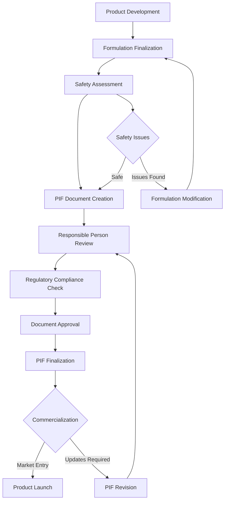

# SKIN-TWIN Product Information File (PIF) Schema Documentation

This document defines the comprehensive schema for Product Information File (PIF) documents within the SKIN-TWIN hypergraph architecture, ensuring compliance with EU Cosmetic Regulation (EC) No 1223/2009.

## Overview

Product Information Files (PIFs) are regulatory documents required for cosmetic products in the European Union. They contain comprehensive information about product formulation, safety assessment, manufacturing details, and regulatory compliance. PIFs serve as the central documentation linking formulations, regulatory data, and product commercialization.

## TypeScript Interface

```typescript
interface PIFSchema {
  // Core Identity
  id: string;                    // Unique PIF identifier
  documentVersion: string;       // PIF document version
  creationDate: Date;           // Document creation date
  lastUpdated: Date;            // Last modification date
  status: PIFStatus;            // Document approval status
  
  // Product Information
  productInfo: ProductInformation;
  formulationInfo: FormulationInformation;
  responsiblePerson: ResponsiblePersonInfo;
  
  // Safety & Usage
  safetyAssessment: SafetyAssessmentData;
  usageInstructions: UsageInstructions;
  precautions: PrecautionaryMeasures;
  
  // Technical Data
  manufacturingInfo: ManufacturingInformation;
  qualityControl: QualityControlData;
  ingredients: IngredientDeclaration[];
  
  // Regulatory Compliance
  regulatoryInfo: RegulatoryCompliance;
  claims: ProductClaims[];
  labeling: LabelingRequirements;
  
  // Supporting Documentation
  attachments: DocumentAttachment[];
  references: ScientificReference[];
  
  // Metadata
  createdBy: string;
  approvedBy?: string;
  approvalDate?: Date;
  nextReviewDate: Date;
  tags: string[];
}

interface ProductInformation {
  productName: string;           // Commercial product name
  brandName: string;            // Brand identification
  productCategory: ProductCategory;
  targetConsumer: TargetConsumer;
  intendedUse: string;          // Primary product function
  applicationArea: string[];     // Body areas for application
  formulationReference: string;  // Link to formulation ID
  productCode?: string;         // Internal product code
  barcode?: string;             // Product barcode
}

interface FormulationInformation {
  formulationId: string;        // Reference to formulation schema
  formulationName: string;      // Formulation commercial name
  version: string;              // Formulation version
  developmentDate: Date;        // Formulation development date
  type: FormulationType;        // Product type classification
  phases: PhaseDescription[];   // Formulation phases
  totalIngredients: number;     // Total number of ingredients
  waterContent: number;         // Water percentage
  preservativeSystem: string;   // Preservation approach
}

interface ResponsiblePersonInfo {
  name: string;                 // Legal name
  company: string;              // Company name
  address: ContactAddress;      // Full contact address
  phone: string;                // Contact phone number
  email: string;                // Contact email
  qualifications: string[];     // Professional qualifications
  responsibilityScope: string;  // Scope of responsibility
  appointmentDate: Date;        // Date of appointment
  signature?: string;           // Digital signature
}

interface SafetyAssessmentData {
  assessmentDate: Date;         // Safety assessment completion date
  assessor: SafetyAssessor;     // Qualified safety assessor info
  methodology: string;          // Assessment methodology used
  conclusion: SafetyConclusion; // Overall safety conclusion
  restrictions: UsageRestriction[]; // Any usage restrictions
  contraindications: string[];  // Product contraindications
  adverseEffects: AdverseEffect[]; // Known adverse effects
  toxicologicalProfile: ToxicologicalData;
  dermalCompatibility: DermalCompatibilityData;
  microbiological: MicrobiologicalSafety;
}

interface UsageInstructions {
  applicationMethod: string;    // How to apply the product
  frequency: string;           // Usage frequency recommendations
  quantity: string;            // Recommended quantity per use
  contactTime: string;         // Duration of skin contact
  washOffInstructions?: string; // If applicable
  storageInstructions: string; // Storage requirements
  shelfLife: number;           // Shelf life in months
  periodAfterOpening: number;  // PAO in months
  temperatureRange: TemperatureRange;
}

interface PrecautionaryMeasures {
  generalPrecautions: string[]; // General safety precautions
  sensitizationWarnings: string[]; // Allergy warnings
  eyeContact: string;          // Eye contact instructions
  ingestion: string;           // Accidental ingestion guidance
  skinIrritation: string;      // Skin irritation guidance
  pregnancyWarnings?: string;  // Pregnancy-related warnings
  childSafety: string;         // Child safety measures
  firstAid: FirstAidMeasures;
}

interface ManufacturingInformation {
  manufacturer: ManufacturerInfo;
  productionSite: ProductionSiteInfo;
  manufacturingProcess: ProcessDescription;
  batchSize: BatchSizeInfo;
  qualityStandards: QualityStandard[];
  equipmentRequirements: EquipmentRequirement[];
  environmentalControls: EnvironmentalControl[];
  gmpCompliance: GMPCompliance;
}

interface QualityControlData {
  specifications: ProductSpecification[];
  testMethods: TestMethod[];
  acceptanceCriteria: AcceptanceCriterion[];
  batchTesting: BatchTestingProtocol;
  stabilityTesting: StabilityTestingData;
  microbiologicalTesting: MicrobiologicalTestingData;
  releaseProtocol: ReleaseProtocol;
  retainedSamples: RetainedSampleRequirement;
}

interface IngredientDeclaration {
  inci: string;                // INCI name
  tradeName?: string;          // Trade name if applicable
  function: IngredientFunction; // Primary function
  concentration: number;        // Percentage by weight
  concentrationRange?: ConcentrationRange;
  supplier: SupplierInfo;      // Supplier information
  origin: string;              // Geographic origin
  specifications: IngredientSpecification[];
  allergens: AllergenInfo[];   // Allergenic potential
  restrictions: IngredientRestriction[];
  safetyData: IngredientSafetyData;
}

interface RegulatoryCompliance {
  euCompliance: EUComplianceData;
  otherRegions: RegionalCompliance[];
  notifications: RegulatoryNotification[];
  registrations: ProductRegistration[];
  certifications: ProductCertification[];
  annexRestrictions: AnnexRestriction[];
  cosing: CosingCompliance;
}

type PIFStatus = 
  | "draft" 
  | "under_review" 
  | "approved" 
  | "requires_update" 
  | "archived";

type ProductCategory = 
  | "skincare" 
  | "haircare" 
  | "makeup" 
  | "fragrance" 
  | "sun_protection" 
  | "hygiene" 
  | "oral_care";

type FormulationType = 
  | "emulsion" 
  | "solution" 
  | "suspension" 
  | "powder" 
  | "stick" 
  | "aerosol" 
  | "other";

type TargetConsumer = 
  | "adults" 
  | "children_over_3" 
  | "infants" 
  | "pregnant_women" 
  | "all_ages";
```

## Schema Relationships

```mermaid
graph TB
    PIF[PIF Document] --> PI[Product Information]
    PIF --> FI[Formulation Information]
    PIF --> RP[Responsible Person]
    PIF --> SA[Safety Assessment]
    PIF --> UI[Usage Instructions]
    PIF --> PM[Precautionary Measures]
    PIF --> MI[Manufacturing Info]
    PIF --> QC[Quality Control]
    PIF --> ID[Ingredient Declaration]
    PIF --> RC[Regulatory Compliance]
    
    PI --> PC[Product Category]
    PI --> TC[Target Consumer]
    
    FI --> F[Formulation Schema]
    FI --> PD[Phase Description]
    
    SA --> SAR[Safety Assessor]
    SA --> SC[Safety Conclusion]
    SA --> TD[Toxicological Data]
    SA --> DC[Dermal Compatibility]
    
    ID --> IF[Ingredient Function]
    ID --> SI[Supplier Info]
    ID --> AI[Allergen Info]
    ID --> ISD[Ingredient Safety Data]
    
    RC --> EU[EU Compliance]
    RC --> OR[Other Regions]
    RC --> RN[Regulatory Notifications]
```



## Validation Rules

### Core Requirements
- `id`: Must be unique across all PIF documents
- `productName`: Required, 3-100 characters
- `documentVersion`: Must follow semantic versioning (x.y.z)
- `responsiblePerson`: Must have qualified safety assessor
- `safetyAssessment`: Required for all cosmetic products
- `ingredients`: Must list all ingredients in descending order by weight

### Regulatory Validation
```typescript
const validatePIFCompliance = (pif: PIFSchema): ValidationResult => {
  const errors: string[] = [];
  
  // EU Regulation compliance
  if (!pif.safetyAssessment.conclusion.overall) {
    errors.push('Product safety assessment must conclude product is safe');
  }
  
  // Responsible person validation
  if (!pif.responsiblePerson.qualifications.includes('safety_assessor')) {
    errors.push('Responsible person must be qualified safety assessor');
  }
  
  // Ingredient compliance
  pif.ingredients.forEach(ingredient => {
    if (!isINCICompliant(ingredient.inci)) {
      errors.push(`Invalid INCI name: ${ingredient.inci}`);
    }
    
    if (hasRestrictedUse(ingredient)) {
      validateRestrictions(ingredient);
    }
  });
  
  // Labeling requirements
  if (!validateLabelingCompliance(pif.labeling)) {
    errors.push('Labeling requirements not met');
  }
  
  return {
    valid: errors.length === 0,
    errors
  };
};
```

## Document Generation Workflow



## Integration with SKIN-TWIN Hypergraph

### Node Representation
```typescript
interface PIFNode {
  id: string;
  type: "pif_document";
  data: PIFSchema;
  metadata: {
    complianceScore: number;    // Regulatory compliance score
    completeness: number;       // Document completeness percentage
    riskLevel: "low" | "medium" | "high";
    marketReadiness: number;    // Commercial readiness score
  };
}
```

### Edge Types
- **DOCUMENTS**: PIF → Product (documentation relationship)
- **REFERENCES**: PIF → Formulation (formulation reference)
- **ASSESSED_BY**: PIF → Safety Assessor
- **COMPLIES_WITH**: PIF → Regulation
- **CONTAINS**: PIF → Ingredient (ingredient declaration)
- **MANUFACTURED_BY**: PIF → Manufacturer
- **TARGETS**: PIF → Consumer Segment

### Network Queries
```cypher
// Find PIFs for specific product category
MATCH (p:PIF)-[:DOCUMENTS]->(prod:Product)
WHERE prod.category = "anti-aging"
RETURN p, prod

// Find safety assessments by assessor
MATCH (p:PIF)-[:ASSESSED_BY]->(sa:SafetyAssessor)
WHERE sa.qualification = "toxicologist"
RETURN p, sa

// Compliance tracking across regions
MATCH (p:PIF)-[:COMPLIES_WITH]->(r:Regulation)
WHERE r.region = "EU"
RETURN p.id, r.name, p.status
```

## Document Templates

### Basic PIF Template
```typescript
const createBasicPIF = (productData: ProductData): PIFSchema => {
  return {
    id: generatePIFId(productData),
    documentVersion: "1.0.0",
    creationDate: new Date(),
    lastUpdated: new Date(),
    status: "draft",
    
    productInfo: {
      productName: productData.name,
      brandName: productData.brand,
      productCategory: productData.category,
      targetConsumer: "adults",
      intendedUse: productData.primaryFunction,
      applicationArea: productData.applicationAreas,
      formulationReference: productData.formulationId
    },
    
    // Initialize other sections with defaults
    safetyAssessment: createDefaultSafetyAssessment(),
    usageInstructions: createDefaultUsage(),
    manufacturingInfo: createDefaultManufacturing(),
    // ... other sections
  };
};
```

### Advanced PIF Generation
```typescript
const generateComprehensivePIF = async (
  formulation: FormulationSchema,
  productInfo: ProductInformation,
  assessmentData: SafetyAssessmentData
): Promise<PIFSchema> => {
  
  const ingredients = await enrichIngredientData(formulation.ingredients);
  const manufacturingInfo = await getManufacturingDetails(formulation.process);
  const regulatoryData = await checkRegulatoryCompliance(ingredients);
  
  return {
    // Core document info
    id: generateUniqueId(),
    documentVersion: "1.0.0",
    creationDate: new Date(),
    
    // Populate from formulation data
    formulationInfo: mapFormulationToPIF(formulation),
    ingredients: ingredients.map(mapIngredientToPIF),
    
    // Safety and regulatory
    safetyAssessment: assessmentData,
    regulatoryInfo: regulatoryData,
    
    // Manufacturing
    manufacturingInfo: manufacturingInfo,
    qualityControl: await generateQCProtocol(formulation),
    
    // Auto-generate usage instructions
    usageInstructions: generateUsageInstructions(productInfo),
    precautions: generatePrecautions(assessmentData)
  };
};
```

## Quality Assurance

### Automated Document Review
```typescript
const performPIFQualityCheck = (pif: PIFSchema): PIFQualityReport => {
  const checks = [
    validateDocumentCompleteness,
    validateRegulatoryCompliance,
    validateSafetyAssessmentQuality,
    validateIngredientDeclarations,
    validateManufacturingInfo,
    validateUsageInstructions
  ];
  
  const results = checks.map(check => check(pif));
  
  return {
    overallScore: calculateQualityScore(results),
    completeness: calculateCompleteness(pif),
    complianceLevel: assessComplianceLevel(results),
    recommendations: generateImprovementRecommendations(results),
    criticalIssues: identifyCriticalIssues(results),
    approvalReady: isApprovalReady(results)
  };
};
```

## Export Formats

### PDF Generation
```typescript
const generatePIFPDF = async (pif: PIFSchema): Promise<Blob> => {
  const doc = new PDFDocument();
  
  // Document header
  addPIFHeader(doc, pif);
  
  // Product information section
  addProductInfoSection(doc, pif.productInfo);
  
  // Safety assessment section
  addSafetyAssessmentSection(doc, pif.safetyAssessment);
  
  // Ingredient declaration
  addIngredientDeclarationSection(doc, pif.ingredients);
  
  // Manufacturing information
  addManufacturingSection(doc, pif.manufacturingInfo);
  
  // Regulatory compliance
  addRegulatorySection(doc, pif.regulatoryInfo);
  
  // Signatures and approvals
  addSignatureSection(doc, pif.responsiblePerson);
  
  return doc.output('blob');
};
```

## Usage Examples

### Creating a New PIF
```typescript
const newPIF: PIFSchema = {
  id: "pif-moisturizer-2024-001",
  documentVersion: "1.0.0",
  creationDate: new Date(),
  lastUpdated: new Date(),
  status: "draft",
  
  productInfo: {
    productName: "Hydrating Daily Moisturizer",
    brandName: "SkinTwin Cosmetics",
    productCategory: "skincare",
    targetConsumer: "adults",
    intendedUse: "Daily facial moisturizing",
    applicationArea: ["face", "neck"],
    formulationReference: "STF-MOIST-001"
  },
  
  responsiblePerson: {
    name: "Dr. Sarah Johnson",
    company: "SkinTwin Safety Consulting",
    address: {
      street: "123 Science Park",
      city: "Cambridge",
      country: "United Kingdom",
      postalCode: "CB1 2AB"
    },
    phone: "+44 1223 123456",
    email: "sarah.johnson@skintwin.com",
    qualifications: ["PhD Toxicology", "Certified Safety Assessor"],
    responsibilityScope: "Product safety assessment and PIF approval",
    appointmentDate: new Date("2024-01-01")
  }
  
  // ... additional sections
};
```

### PIF Document Analysis
```typescript
const analyzePIFDocument = async (pif: PIFSchema) => {
  const analysis = {
    compliance: await assessRegulatoryCompliance(pif),
    safety: evaluateSafetyProfile(pif.safetyAssessment),
    completeness: calculateDocumentCompleteness(pif),
    marketReadiness: assessMarketReadiness(pif),
    riskAssessment: performRiskAssessment(pif),
    recommendations: generateRecommendations(pif)
  };
  
  return analysis;
};
```

This schema provides a comprehensive framework for creating, managing, and analyzing Product Information Files within the SKIN-TWIN ecosystem, ensuring full regulatory compliance and integration with the cosmetic product development workflow.