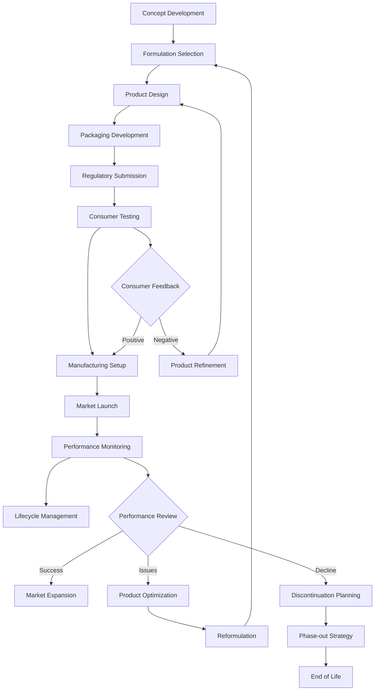

# SKIN-TWIN Products Schema Documentation

This document defines the comprehensive schema for cosmetic products within the SKIN-TWIN hypergraph architecture.

## Overview

Products represent the final consumer-facing cosmetic items that result from formulations. They include marketing information, packaging details, regulatory approvals, and consumer feedback data that bridges the gap between formulation science and market reality.

## TypeScript Interface

```typescript
interface ProductSchema {
  // Core Identity
  id: string;                    // Unique product identifier
  name: string;                  // Commercial product name
  brand: string;                 // Brand name
  sku: string;                   // Stock keeping unit
  barcode?: string;              // UPC/EAN barcode
  
  // Formulation Link
  formulationId: string;         // Reference to base formulation
  formulation: FormulationReference;
  variants?: ProductVariant[];   // Size/color/scent variants
  
  // Product Classification
  category: ProductCategory;
  subcategory: string;
  productType: ProductType;
  targetDemographic: TargetDemographic;
  skinType: SkinType[];
  
  // Commercial Information
  pricing: PricingData;
  packaging: PackagingDetails;
  distribution: DistributionData;
  availability: AvailabilityData;
  
  // Marketing & Claims
  marketing: MarketingData;
  claims: ProductClaim[];
  benefits: ConsumerBenefit[];
  positioning: BrandPositioning;
  
  // Regulatory & Compliance
  regulatory: ProductRegulatoryData;
  certifications: ProductCertification[];
  labeling: LabelingRequirements;
  notifications: RegulatoryNotification[];
  
  // Performance & Feedback
  performance: ProductPerformance;
  reviews: ConsumerReview[];
  testing: ConsumerTesting;
  complaints: ProductComplaint[];
  
  // Supply Chain
  manufacturing: ManufacturingData;
  suppliers: SupplierNetwork;
  qualityControl: ProductQC;
  traceability: TraceabilityData;
  
  // Sustainability
  sustainability: SustainabilityProfile;
  lifecycle: LifecycleAssessment;
  packaging: PackagingSustainability;
  
  // Metadata
  launchDate: Date;
  discontinuedDate?: Date;
  lastUpdated: Date;
  version: string;
  status: ProductStatus;
}

interface FormulationReference {
  id: string;
  name: string;
  version: string;
  modifications?: FormulationModification[];
}

interface ProductVariant {
  id: string;
  name: string;
  variation: VariationType;
  value: string;               // Size, color, scent value
  sku: string;
  pricing: PricingData;
  availability: AvailabilityData;
}

interface PackagingDetails {
  primary: PackagingComponent;
  secondary?: PackagingComponent;
  tertiary?: PackagingComponent;
  total: PackagingFootprint;
  sustainability: PackagingSustainability;
}

interface PackagingComponent {
  type: PackagingType;
  material: PackagingMaterial;
  size: PackagingSize;
  color: string;
  finish: string;
  closure?: ClosureType;
  dispensing?: DispensingMechanism;
  barrier?: BarrierProperties;
  recyclability: RecyclabilityData;
}

interface MarketingData {
  tagline: string;
  description: string;
  keyMessages: string[];
  targetAudience: TargetAudience;
  channels: MarketingChannel[];
  campaigns: MarketingCampaign[];
  influencers?: InfluencerPartnership[];
}

interface ProductPerformance {
  sales: SalesData;
  market: MarketPerformance;
  consumer: ConsumerSatisfaction;
  clinical: ClinicalResults;
  competitor: CompetitorAnalysis;
}

interface ConsumerReview {
  id: string;
  platform: ReviewPlatform;
  rating: number;              // 1-5 scale
  review: string;
  verified: boolean;
  demographics: ReviewerDemographics;
  aspects: ReviewAspect[];
  sentiment: SentimentAnalysis;
  date: Date;
}

interface SustainabilityProfile {
  carbonFootprint: CarbonFootprint;
  waterFootprint: WaterFootprint;
  biodiversity: BiodiversityImpact;
  social: SocialImpact;
  circular: CircularityMetrics;
  certifications: SustainabilityCertification[];
}

type ProductCategory = 
  | "skincare" 
  | "makeup" 
  | "haircare" 
  | "fragrance" 
  | "body_care" 
  | "sun_care" 
  | "mens_grooming";

type ProductType = 
  | "serum" 
  | "moisturizer" 
  | "cleanser" 
  | "toner" 
  | "mask" 
  | "treatment" 
  | "foundation" 
  | "concealer" 
  | "lipstick" 
  | "eyeshadow";

type ProductStatus = 
  | "development" 
  | "testing" 
  | "launched" 
  | "mature" 
  | "declining" 
  | "discontinued";

type VariationType = 
  | "size" 
  | "color" 
  | "scent" 
  | "concentration" 
  | "texture";

type PackagingType = 
  | "bottle" 
  | "tube" 
  | "jar" 
  | "pump" 
  | "dropper" 
  | "stick" 
  | "compact" 
  | "sachet";
```

## Schema Relationships

```mermaid
graph TB
    P[Product] --> F[Formulation]
    P --> PK[Packaging]
    P --> M[Marketing]
    P --> R[Regulatory]
    P --> PF[Performance]
    P --> S[Sustainability]
    P --> MF[Manufacturing]
    P --> D[Distribution]
    
    F --> I[Ingredients]
    F --> PR[Process]
    
    PK --> PC[Primary Container]
    PK --> SC[Secondary Packaging]
    PK --> TC[Tertiary Packaging]
    
    M --> TA[Target Audience]
    M --> CH[Channels]
    M --> CP[Campaigns]
    M --> CL[Claims]
    
    R --> AP[Approvals]
    R --> LB[Labeling]
    R --> NT[Notifications]
    R --> CT[Certifications]
    
    PF --> SA[Sales]
    PF --> CS[Consumer Satisfaction]
    PF --> CR[Clinical Results]
    PF --> CA[Competitor Analysis]
    
    S --> CF[Carbon Footprint]
    S --> WF[Water Footprint]
    S --> BI[Biodiversity Impact]
    S --> SI[Social Impact]
    
    MF --> SP[Suppliers]
    MF --> QC[Quality Control]
    MF --> TR[Traceability]
    
    D --> CH[Channels]
    D --> AV[Availability]
    D --> PR[Pricing]
```



## Validation Framework

### Core Product Validation
```typescript
const validateProduct = (product: ProductSchema): ValidationResult => {
  const errors: string[] = [];
  const warnings: string[] = [];
  
  // Core identity validation
  if (!product.name || product.name.length < 3) {
    errors.push('Product name must be at least 3 characters');
  }
  
  if (!product.brand || product.brand.length < 2) {
    errors.push('Brand name is required');
  }
  
  // Formulation link validation
  if (!product.formulationId) {
    errors.push('Product must reference a formulation');
  }
  
  // Pricing validation
  if (product.pricing.msrp <= 0) {
    errors.push('MSRP must be positive');
  }
  
  if (product.pricing.cost >= product.pricing.msrp) {
    warnings.push('Cost exceeds or equals MSRP - check profitability');
  }
  
  // Claims validation
  const hasUnsubstantiatedClaims = product.claims
    .some(claim => !claim.substantiation || claim.substantiation.length === 0);
  
  if (hasUnsubstantiatedClaims) {
    warnings.push('Some claims lack substantiation data');
  }
  
  // Regulatory validation
  const requiredApprovals = getRequiredApprovals(product.category, product.distribution.regions);
  const missingApprovals = requiredApprovals.filter(
    approval => !product.regulatory.approvals.some(a => a.type === approval)
  );
  
  if (missingApprovals.length > 0) {
    errors.push(`Missing regulatory approvals: ${missingApprovals.join(', ')}`);
  }
  
  return {
    valid: errors.length === 0,
    errors,
    warnings
  };
};
```

### Market Readiness Assessment
```typescript
const assessMarketReadiness = (product: ProductSchema): MarketReadinessReport => {
  const criteria = [
    {
      name: 'Regulatory Compliance',
      weight: 0.25,
      score: calculateRegulatoryScore(product.regulatory)
    },
    {
      name: 'Quality Assurance',
      weight: 0.20,
      score: calculateQualityScore(product.qualityControl)
    },
    {
      name: 'Market Positioning',
      weight: 0.20,
      score: calculatePositioningScore(product.marketing)
    },
    {
      name: 'Supply Chain Readiness',
      weight: 0.15,
      score: calculateSupplyChainScore(product.manufacturing)
    },
    {
      name: 'Sustainability Profile',
      weight: 0.10,
      score: calculateSustainabilityScore(product.sustainability)
    },
    {
      name: 'Competitive Analysis',
      weight: 0.10,
      score: calculateCompetitiveScore(product.performance.competitor)
    }
  ];
  
  const overallScore = criteria.reduce((sum, criterion) => 
    sum + (criterion.score * criterion.weight), 0
  );
  
  return {
    overallScore,
    criteria,
    readiness: overallScore >= 0.8 ? 'ready' : overallScore >= 0.6 ? 'needs_improvement' : 'not_ready',
    recommendations: generateReadinessRecommendations(criteria)
  };
};
```

## Product Lifecycle Management

### Product Lifecycle Workflow


### Launch Readiness Checklist
```typescript
const evaluateLaunchReadiness = (product: ProductSchema): LaunchReadinessReport => {
  const checklist = [
    {
      category: 'Regulatory',
      items: [
        { name: 'All required approvals obtained', required: true },
        { name: 'Product notifications filed', required: true },
        { name: 'Labeling approved', required: true },
        { name: 'Claims substantiated', required: true }
      ]
    },
    {
      category: 'Manufacturing',
      items: [
        { name: 'Production capacity confirmed', required: true },
        { name: 'Quality systems validated', required: true },
        { name: 'Supply chain secured', required: true },
        { name: 'Packaging supply confirmed', required: true }
      ]
    },
    {
      category: 'Marketing',
      items: [
        { name: 'Brand positioning defined', required: true },
        { name: 'Target audience identified', required: true },
        { name: 'Launch campaign prepared', required: true },
        { name: 'Distribution channels secured', required: false }
      ]
    },
    {
      category: 'Commercial',
      items: [
        { name: 'Pricing strategy finalized', required: true },
        { name: 'Sales forecasts prepared', required: true },
        { name: 'Inventory planning complete', required: true },
        { name: 'Training materials prepared', required: false }
      ]
    }
  ];
  
  const results = checklist.map(category => ({
    category: category.category,
    items: category.items.map(item => ({
      ...item,
      completed: evaluateChecklistItem(product, category.category, item.name)
    }))
  }));
  
  const criticalIssues = results.flatMap(category => 
    category.items.filter(item => item.required && !item.completed)
  );
  
  return {
    ready: criticalIssues.length === 0,
    checklist: results,
    criticalIssues,
    recommendations: generateLaunchRecommendations(results)
  };
};
```

## Integration with SKIN-TWIN Hypergraph

### Node Representation
```typescript
interface ProductNode {
  id: string;
  type: "product";
  data: ProductSchema;
  metadata: {
    marketSuccess: number;      // Commercial performance score
    innovation: number;         // Innovation index
    sustainability: number;     // Environmental impact score
    consumer: number;          // Consumer satisfaction score
  };
}
```

### Advanced Graph Analytics
```cypher
// Find successful product formulations by category
MATCH (p:Product)-[:USES_FORMULATION]->(f:Formulation)
WHERE p.category = "anti-aging" AND p.performance.sales.revenue > 1000000
RETURN f, collect(p.name) as successful_products

// Analyze packaging trends across brands
MATCH (p:Product)
WHERE p.launchDate > date('2020-01-01')
WITH p.brand, p.packaging.primary.material as material, count(*) as usage_count
RETURN brand, material, usage_count
ORDER BY brand, usage_count DESC

// Find products with similar target demographics
MATCH (p1:Product), (p2:Product)
WHERE p1.targetDemographic.ageRange = p2.targetDemographic.ageRange
  AND p1.targetDemographic.skinType = p2.targetDemographic.skinType
  AND p1.id <> p2.id
RETURN p1.name, p2.name, p1.targetDemographic

// Trace product sustainability impact
MATCH (p:Product)-[:USES_FORMULATION]->(f:Formulation)-[:CONTAINS]->(i:Ingredient)
WHERE p.sustainability.carbonFootprint.total < 50
RETURN p.name, 
       p.sustainability.carbonFootprint.total as carbon_footprint,
       collect(i.inci) as sustainable_ingredients
```

### Product Performance Analytics
```typescript
class ProductAnalytics {
  async getMarketPerformance(productId: string): Promise<MarketAnalysis> {
    const product = await this.getProduct(productId);
    const competitors = await this.findCompetitors(product);
    const marketData = await this.getMarketData(product.category);
    
    return {
      marketShare: this.calculateMarketShare(product, marketData),
      competitivePosition: this.analyzeCompetitivePosition(product, competitors),
      trends: this.identifyMarketTrends(product.category),
      opportunities: this.identifyOpportunities(product, marketData)
    };
  }
  
  async predictProductSuccess(product: ProductSchema): Promise<SuccessPrediction> {
    const features = this.extractFeatures(product);
    const model = await this.loadPredictionModel();
    
    const prediction = await model.predict(features);
    
    return {
      successProbability: prediction.probability,
      confidence: prediction.confidence,
      keyFactors: this.identifyKeyFactors(features, prediction),
      recommendations: this.generateRecommendations(product, prediction)
    };
  }
  
  async optimizeProductMix(products: ProductSchema[]): Promise<OptimizationResult> {
    const analysis = await Promise.all(
      products.map(p => this.analyzeProduct(p))
    );
    
    return {
      recommendations: this.generateMixRecommendations(analysis),
      cannibalization: this.analyzeCannibalization(products),
      gaps: this.identifyPortfolioGaps(products),
      priorities: this.prioritizeProducts(analysis)
    };
  }
}
```

## Quality Assurance Framework

### Product Quality Assessment
```typescript
const assessProductQuality = (product: ProductSchema): QualityAssessment => {
  const dimensions = [
    {
      name: 'Formulation Quality',
      weight: 0.25,
      score: evaluateFormulationQuality(product.formulation)
    },
    {
      name: 'Manufacturing Quality',
      weight: 0.20,
      score: evaluateManufacturingQuality(product.manufacturing)
    },
    {
      name: 'Packaging Quality',
      weight: 0.15,
      score: evaluatePackagingQuality(product.packaging)
    },
    {
      name: 'Consumer Experience',
      weight: 0.20,
      score: evaluateConsumerExperience(product.reviews)
    },
    {
      name: 'Regulatory Compliance',
      weight: 0.20,
      score: evaluateRegulatoryCompliance(product.regulatory)
    }
  ];
  
  const overallScore = dimensions.reduce((sum, dim) => 
    sum + (dim.score * dim.weight), 0
  );
  
  return {
    overallScore,
    dimensions,
    grade: calculateQualityGrade(overallScore),
    improvements: identifyImprovementAreas(dimensions)
  };
};
```

## Usage Examples

### Creating a New Product
```typescript
const newProduct: ProductSchema = {
  id: "advanced-peptide-serum-001",
  name: "Advanced Peptide Complex Serum",
  brand: "SKIN-TWIN Scientific",
  sku: "STS-APC-30ML",
  formulationId: "advanced-peptide-complex-v1",
  formulation: {
    id: "advanced-peptide-complex-v1",
    name: "Advanced Peptide Complex",
    version: "1.0.0"
  },
  category: "skincare",
  subcategory: "serums",
  productType: "serum",
  targetDemographic: {
    ageRange: { min: 30, max: 60 },
    gender: "all",
    skinType: ["mature", "all"],
    concerns: ["aging", "wrinkles", "firmness"]
  },
  pricing: {
    cost: 15.50,
    msrp: 89.99,
    currency: "USD",
    margin: 0.827
  },
  packaging: {
    primary: {
      type: "dropper",
      material: "glass",
      size: { value: 30, unit: "ml" },
      color: "amber",
      finish: "matte",
      closure: "dropper_cap",
      recyclability: {
        recyclable: true,
        instructions: "Remove dropper, rinse bottle"
      }
    }
  },
  marketing: {
    tagline: "Unlock Your Skin's Potential",
    description: "Revolutionary peptide complex that visibly reduces signs of aging",
    keyMessages: [
      "Clinically proven peptide technology",
      "Visible results in 4 weeks",
      "Clean, science-backed formula"
    ],
    targetAudience: {
      primary: "Premium skincare enthusiasts",
      secondary: "Anti-aging conscious consumers"
    }
  },
  status: "launched",
  launchDate: new Date("2024-03-15"),
  version: "1.0.0"
  // ... additional properties
};
```

### Product Performance Analysis
```typescript
const analyzeProductPerformance = async (productId: string) => {
  const product = await getProduct(productId);
  
  const analysis = {
    sales: await analyzeSalesPerformance(product),
    consumer: await analyzeConsumerFeedback(product),
    market: await analyzeMarketPosition(product),
    profitability: calculateProfitability(product),
    lifecycle: assessLifecycleStage(product),
    optimization: identifyOptimizationOpportunities(product)
  };
  
  return {
    ...analysis,
    summary: generatePerformanceSummary(analysis),
    recommendations: generateActionableRecommendations(analysis)
  };
};
```

This comprehensive product schema enables sophisticated product lifecycle management, market analysis, and commercial optimization within the SKIN-TWIN ecosystem.