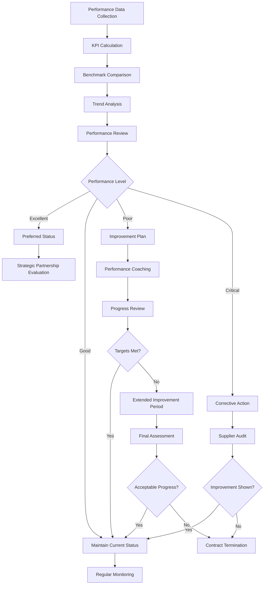

# SKIN-TWIN Suppliers Schema Documentation

This document defines the comprehensive schema for cosmetic industry suppliers within the SKIN-TWIN hypergraph architecture.

## Overview

Suppliers are critical entities in the cosmetic supply chain, providing raw materials, ingredients, packaging, and services. This schema captures their capabilities, relationships, performance metrics, and strategic value within the SKIN-TWIN ecosystem.

## TypeScript Interface

```typescript
interface SupplierSchema {
  // Core Identity
  id: string;                    // Unique supplier identifier
  name: string;                  // Legal company name
  tradeName?: string;            // Operating/trade name
  type: SupplierType;           // Primary supplier classification
  
  // Business Information
  business: BusinessInformation;
  contact: ContactInformation;
  locations: SupplierLocation[];
  legal: LegalInformation;
  
  // Capabilities & Services
  capabilities: SupplierCapabilities;
  products: SuppliedProduct[];
  services: SuppliedService[];
  technologies: Technology[];
  
  // Quality & Certifications
  quality: QualityManagement;
  certifications: SupplierCertification[];
  audits: SupplierAudit[];
  compliance: ComplianceStatus;
  
  // Performance & Metrics
  performance: SupplierPerformance;
  financials: FinancialProfile;
  reliability: ReliabilityMetrics;
  innovation: InnovationCapacity;
  
  // Sustainability & Ethics
  sustainability: SustainabilityProfile;
  ethics: EthicalProfile;
  social: SocialResponsibility;
  environmental: EnvironmentalImpact;
  
  // Relationship Management
  relationship: RelationshipData;
  contracts: ContractInformation[];
  partnerships: Partnership[];
  history: SupplierHistory;
  
  // Risk Assessment
  risk: RiskProfile;
  security: SecurityAssessment;
  contingency: ContingencyPlanning;
  
  // Metadata
  established: Date;
  lastAssessment: Date;
  lastUpdated: Date;
  version: string;
  status: SupplierStatus;
}

interface BusinessInformation {
  registrationNumber: string;
  taxId: string;
  industry: IndustryClassification;
  size: CompanySize;
  revenue: RevenueRange;
  employees: EmployeeCount;
  ownership: OwnershipStructure;
  publiclyTraded: boolean;
  stockSymbol?: string;
}

interface SupplierLocation {
  id: string;
  type: LocationType;          // "headquarters" | "manufacturing" | "warehouse" | "office"
  address: Address;
  capabilities: string[];      // What this location can do
  capacity: ProductionCapacity;
  certifications: string[];    // Location-specific certifications
  timezone: string;
  languages: string[];
}

interface SupplierCapabilities {
  manufacturing: ManufacturingCapabilities;
  research: ResearchCapabilities;
  quality: QualityCapabilities;
  supply: SupplyCapabilities;
  technical: TechnicalCapabilities;
  regulatory: RegulatoryCapabilities;
}

interface SuppliedProduct {
  id: string;
  category: ProductCategory;
  name: string;
  description: string;
  specifications: ProductSpecification[];
  minimumOrder: OrderQuantity;
  leadTime: LeadTimeData;
  pricing: PricingStructure;
  availability: AvailabilityStatus;
  certifications: string[];
}

interface SupplierPerformance {
  overall: PerformanceScore;
  delivery: DeliveryPerformance;
  quality: QualityPerformance;
  service: ServicePerformance;
  innovation: InnovationPerformance;
  cost: CostPerformance;
  sustainability: SustainabilityPerformance;
  historical: HistoricalPerformance[];
}

interface RiskProfile {
  overall: RiskLevel;
  categories: RiskCategory[];
  financial: FinancialRisk;
  operational: OperationalRisk;
  regulatory: RegulatoryRisk;
  geopolitical: GeopoliticalRisk;
  environmental: EnvironmentalRisk;
  cyber: CyberSecurityRisk;
  mitigation: RiskMitigation[];
}

interface SustainabilityProfile {
  overall: SustainabilityScore;
  environmental: EnvironmentalMetrics;
  social: SocialMetrics;
  governance: GovernanceMetrics;
  circular: CircularEconomyMetrics;
  certifications: SustainabilityCertification[];
  reporting: SustainabilityReporting;
  goals: SustainabilityGoal[];
}

type SupplierType = 
  | "raw_material" 
  | "ingredient" 
  | "packaging" 
  | "equipment" 
  | "service" 
  | "contract_manufacturer" 
  | "distributor" 
  | "technology";

type SupplierStatus = 
  | "active" 
  | "preferred" 
  | "approved" 
  | "probation" 
  | "suspended" 
  | "terminated";

type RiskLevel = 
  | "low" 
  | "medium" 
  | "high" 
  | "critical";

type PerformanceScore = {
  score: number;               // 0-100 scale
  grade: "A" | "B" | "C" | "D" | "F";
  trend: "improving" | "stable" | "declining";
};
```

## Schema Relationships

```mermaid
graph TB
    S[Supplier] --> B[Business Info]
    S --> C[Contact Info]
    S --> L[Locations]
    S --> CAP[Capabilities]
    S --> PROD[Products]
    S --> SERV[Services]
    S --> Q[Quality]
    S --> PERF[Performance]
    S --> SUS[Sustainability]
    S --> R[Risk Profile]
    S --> REL[Relationships]
    
    CAP --> MFG[Manufacturing]
    CAP --> RES[Research]
    CAP --> TECH[Technical]
    CAP --> REG[Regulatory]
    
    PROD --> SPEC[Specifications]
    PROD --> PRICE[Pricing]
    PROD --> AVAIL[Availability]
    
    PERF --> DEL[Delivery]
    PERF --> QUAL[Quality]
    PERF --> COST[Cost]
    PERF --> INNOV[Innovation]
    
    SUS --> ENV[Environmental]
    SUS --> SOC[Social]
    SUS --> GOV[Governance]
    
    R --> FIN[Financial Risk]
    R --> OPS[Operational Risk]
    R --> GEO[Geopolitical Risk]
    R --> CYB[Cyber Risk]
    
    REL --> CONT[Contracts]
    REL --> PART[Partnerships]
    REL --> HIST[History]
```



## Validation Framework

### Supplier Qualification Process
```typescript
const qualifySupplier = (supplier: SupplierSchema): QualificationResult => {
  const criteria = [
    {
      name: 'Business Legitimacy',
      weight: 0.15,
      validator: validateBusinessLegitimacy
    },
    {
      name: 'Quality Systems',
      weight: 0.20,
      validator: validateQualitySystems
    },
    {
      name: 'Technical Capabilities',
      weight: 0.15,
      validator: validateTechnicalCapabilities
    },
    {
      name: 'Financial Stability',
      weight: 0.15,
      validator: validateFinancialStability
    },
    {
      name: 'Regulatory Compliance',
      weight: 0.15,
      validator: validateRegulatoryCompliance
    },
    {
      name: 'Sustainability Profile',
      weight: 0.10,
      validator: validateSustainability
    },
    {
      name: 'Risk Assessment',
      weight: 0.10,
      validator: validateRiskProfile
    }
  ];
  
  const results = criteria.map(criterion => {
    const result = criterion.validator(supplier);
    return {
      name: criterion.name,
      weight: criterion.weight,
      score: result.score,
      passed: result.passed,
      issues: result.issues,
      recommendations: result.recommendations
    };
  });
  
  const overallScore = results.reduce((sum, result) => 
    sum + (result.score * result.weight), 0
  );
  
  const qualification = determineQualificationStatus(overallScore, results);
  
  return {
    qualified: qualification.status === 'approved',
    status: qualification.status,
    overallScore,
    criteria: results,
    nextReview: calculateNextReviewDate(supplier, qualification),
    actionItems: generateActionItems(results)
  };
};
```

### Risk Assessment Framework
```typescript
const assessSupplierRisk = (supplier: SupplierSchema): RiskAssessment => {
  const riskFactors = [
    {
      category: 'Financial',
      factors: [
        { name: 'Credit Rating', impact: 'high', probability: getCreditRisk(supplier) },
        { name: 'Revenue Volatility', impact: 'medium', probability: getRevenueVolatility(supplier) },
        { name: 'Debt Ratio', impact: 'medium', probability: getDebtRisk(supplier) }
      ]
    },
    {
      category: 'Operational',
      factors: [
        { name: 'Single Point of Failure', impact: 'high', probability: getSPOFRisk(supplier) },
        { name: 'Capacity Constraints', impact: 'medium', probability: getCapacityRisk(supplier) },
        { name: 'Quality Issues', impact: 'high', probability: getQualityRisk(supplier) }
      ]
    },
    {
      category: 'Geopolitical',
      factors: [
        { name: 'Political Stability', impact: 'high', probability: getPoliticalRisk(supplier) },
        { name: 'Trade Restrictions', impact: 'medium', probability: getTradeRisk(supplier) },
        { name: 'Currency Volatility', impact: 'low', probability: getCurrencyRisk(supplier) }
      ]
    }
  ];
  
  const categoryRisks = riskFactors.map(category => {
    const avgProbability = category.factors.reduce((sum, factor) => 
      sum + factor.probability, 0) / category.factors.length;
    
    const weightedImpact = category.factors.reduce((sum, factor) => 
      sum + getImpactWeight(factor.impact), 0) / category.factors.length;
    
    return {
      category: category.category,
      risk: avgProbability * weightedImpact,
      factors: category.factors
    };
  });
  
  const overallRisk = categoryRisks.reduce((sum, cat) => sum + cat.risk, 0) / categoryRisks.length;
  
  return {
    overallRisk,
    riskLevel: determineRiskLevel(overallRisk),
    categories: categoryRisks,
    mitigation: generateMitigationStrategies(categoryRisks),
    monitoring: defineMonitoringPlan(categoryRisks)
  };
};
```

## Supplier Performance Management

### Performance Monitoring Workflow


### Supplier Scorecard System
```typescript
class SupplierScorecard {
  private weights = {
    delivery: 0.25,
    quality: 0.25,
    cost: 0.15,
    service: 0.15,
    innovation: 0.10,
    sustainability: 0.10
  };
  
  calculateOverallScore(supplier: SupplierSchema): SupplierScore {
    const scores = {
      delivery: this.calculateDeliveryScore(supplier.performance.delivery),
      quality: this.calculateQualityScore(supplier.performance.quality),
      cost: this.calculateCostScore(supplier.performance.cost),
      service: this.calculateServiceScore(supplier.performance.service),
      innovation: this.calculateInnovationScore(supplier.performance.innovation),
      sustainability: this.calculateSustainabilityScore(supplier.sustainability)
    };
    
    const weightedScore = Object.entries(scores).reduce(
      (sum, [category, score]) => sum + (score * this.weights[category]), 0
    );
    
    return {
      overall: weightedScore,
      category: scores,
      grade: this.determineGrade(weightedScore),
      trend: this.calculateTrend(supplier.performance.historical),
      recommendations: this.generateRecommendations(scores)
    };
  }
  
  private calculateDeliveryScore(delivery: DeliveryPerformance): number {
    const onTimeWeight = 0.4;
    const accuracyWeight = 0.3;
    const leadTimeWeight = 0.3;
    
    return (
      delivery.onTimeDelivery * onTimeWeight +
      delivery.orderAccuracy * accuracyWeight +
      (1 - delivery.averageLeadTimeVariance) * leadTimeWeight
    ) * 100;
  }
  
  private calculateQualityScore(quality: QualityPerformance): number {
    const defectWeight = 0.5;
    const complianceWeight = 0.3;
    const correctionWeight = 0.2;
    
    return (
      (1 - quality.defectRate) * defectWeight +
      quality.complianceRate * complianceWeight +
      quality.correctiveActionEffectiveness * correctionWeight
    ) * 100;
  }
}
```

## Integration with SKIN-TWIN Hypergraph

### Supplier Network Analysis
```cypher
// Find strategic suppliers with high innovation capacity
MATCH (s:Supplier)
WHERE s.performance.innovation.score > 80 
  AND s.status = "preferred"
RETURN s.name, s.performance.innovation.score, s.capabilities.research

// Analyze supply chain diversity by region
MATCH (s:Supplier)-[:SUPPLIES]->(i:Ingredient)
WITH s.locations[0].address.country as country, 
     count(DISTINCT i) as ingredient_count,
     count(DISTINCT s) as supplier_count
RETURN country, ingredient_count, supplier_count
ORDER BY ingredient_count DESC

// Find backup suppliers for critical ingredients
MATCH (i:Ingredient)<-[:SUPPLIES]-(s1:Supplier),
      (i)<-[:SUPPLIES]-(s2:Supplier)
WHERE s1.id <> s2.id 
  AND i.criticality = "high"
RETURN i.inci, s1.name, s2.name, s1.risk.overall, s2.risk.overall

// Identify supplier consolidation opportunities
MATCH (s:Supplier)-[:SUPPLIES]->(p:Product)
WITH s, count(p) as product_count, 
     sum(p.volume) as total_volume
WHERE product_count < 5 AND total_volume < 1000
RETURN s.name, product_count, total_volume
ORDER BY total_volume ASC
```

### Supply Chain Optimization
```typescript
class SupplyChainOptimizer {
  async optimizeSupplierPortfolio(
    requirements: SupplyRequirement[],
    constraints: OptimizationConstraint[]
  ): Promise<OptimizationResult> {
    
    const suppliers = await this.getQualifiedSuppliers();
    const capabilities = this.mapSupplierCapabilities(suppliers);
    
    // Multi-objective optimization
    const objectives = [
      { name: 'cost', weight: 0.3, direction: 'minimize' },
      { name: 'risk', weight: 0.25, direction: 'minimize' },
      { name: 'quality', weight: 0.25, direction: 'maximize' },
      { name: 'sustainability', weight: 0.2, direction: 'maximize' }
    ];
    
    const solution = await this.solveOptimization({
      suppliers,
      requirements,
      constraints,
      objectives
    });
    
    return {
      recommendedSuppliers: solution.suppliers,
      expectedCost: solution.cost,
      riskProfile: solution.risk,
      sustainabilityScore: solution.sustainability,
      implementation: this.generateImplementationPlan(solution)
    };
  }
  
  async assessSupplyChainResilience(
    suppliers: SupplierSchema[]
  ): Promise<ResilienceAssessment> {
    
    const scenarios = [
      { name: 'Single Supplier Failure', probability: 0.1 },
      { name: 'Regional Disruption', probability: 0.05 },
      { name: 'Global Pandemic', probability: 0.02 },
      { name: 'Trade War', probability: 0.03 },
      { name: 'Natural Disaster', probability: 0.08 }
    ];
    
    const impacts = await Promise.all(
      scenarios.map(scenario => 
        this.simulateScenarioImpact(suppliers, scenario)
      )
    );
    
    return {
      overallResilience: this.calculateResilienceScore(impacts),
      scenarios: impacts,
      vulnerabilities: this.identifyVulnerabilities(impacts),
      recommendations: this.generateResilienceRecommendations(impacts)
    };
  }
}
```

## Supplier Development & Partnership

### Supplier Development Program
```typescript
const createDevelopmentPlan = (
  supplier: SupplierSchema,
  targetCapabilities: RequiredCapability[]
): DevelopmentPlan => {
  
  const currentCapabilities = assessCurrentCapabilities(supplier);
  const gaps = identifyCapabilityGaps(currentCapabilities, targetCapabilities);
  
  const initiatives = gaps.map(gap => {
    const initiative = {
      name: `Develop ${gap.capability}`,
      description: gap.description,
      timeline: estimateTimeline(gap),
      investment: estimateInvestment(gap),
      milestones: defineMilestones(gap),
      success_criteria: defineSuccessCriteria(gap),
      support_required: identifySupport(gap)
    };
    
    return initiative;
  });
  
  return {
    supplier: supplier.id,
    objectives: targetCapabilities,
    currentState: currentCapabilities,
    gaps,
    initiatives,
    timeline: calculateOverallTimeline(initiatives),
    investment: calculateTotalInvestment(initiatives),
    expectedBenefits: calculateExpectedBenefits(initiatives)
  };
};
```

### Partnership Evaluation Framework
```typescript
const evaluatePartnershipPotential = (
  supplier: SupplierSchema
): PartnershipAssessment => {
  
  const criteria = [
    {
      name: 'Strategic Alignment',
      weight: 0.25,
      score: assessStrategicAlignment(supplier)
    },
    {
      name: 'Innovation Capacity',
      weight: 0.20,
      score: assessInnovationCapacity(supplier)
    },
    {
      name: 'Financial Strength',
      weight: 0.15,
      score: assessFinancialStrength(supplier)
    },
    {
      name: 'Market Position',
      weight: 0.15,
      score: assessMarketPosition(supplier)
    },
    {
      name: 'Cultural Fit',
      weight: 0.15,
      score: assessCulturalFit(supplier)
    },
    {
      name: 'Risk Profile',
      weight: 0.10,
      score: 100 - supplier.risk.overall // Lower risk = higher score
    }
  ];
  
  const overallScore = criteria.reduce((sum, criterion) => 
    sum + (criterion.score * criterion.weight), 0
  );
  
  const recommendation = determinePartnershipRecommendation(overallScore, criteria);
  
  return {
    overallScore,
    criteria,
    recommendation: recommendation.type,
    reasoning: recommendation.reasoning,
    nextSteps: recommendation.nextSteps,
    partnershipType: recommendation.suggestedType
  };
};
```

## Usage Examples

### Creating a New Supplier Profile
```typescript
const newSupplier: SupplierSchema = {
  id: "peptide-innovations-intl",
  name: "Peptide Innovations International Ltd.",
  tradeName: "Peptide Innovations",
  type: "ingredient",
  business: {
    registrationNumber: "GB12345678",
    taxId: "GB123456789",
    industry: "specialty_chemicals",
    size: "medium",
    revenue: { min: 50000000, max: 100000000, currency: "USD" },
    employees: { count: 150, range: "100-500" },
    ownership: "private",
    publiclyTraded: false
  },
  contact: {
    headquarters: {
      address: {
        street: "123 Innovation Drive",
        city: "Cambridge",
        state: "England",
        country: "United Kingdom",
        postalCode: "CB1 2AB"
      },
      phone: "+44-1223-123456",
      email: "contact@peptideinnovations.com",
      website: "https://www.peptideinnovations.com"
    }
  },
  capabilities: {
    manufacturing: {
      peptideSynthesis: true,
      customSynthesis: true,
      scaleUp: true,
      qualityControl: true,
      capacity: { value: 1000, unit: "kg/month" }
    },
    research: {
      rd_investment: { percentage: 15, amount: 7500000 },
      patents: 25,
      publications: 45,
      collaborations: ["University of Cambridge", "MIT"]
    },
    technical: {
      consultingServices: true,
      formulationSupport: true,
      analyticalTesting: true,
      stabilityTesting: true
    }
  },
  products: [
    {
      id: "palmitoyl-tripeptide-1",
      category: "active_ingredient",
      name: "Palmitoyl Tripeptide-1",
      description: "Anti-aging peptide for collagen stimulation",
      minimumOrder: { value: 1, unit: "kg" },
      leadTime: { standard: 14, express: 7, unit: "days" },
      certifications: ["COSMOS", "ECOCERT", "ISO 16128"]
    }
  ],
  performance: {
    overall: { score: 92, grade: "A", trend: "stable" },
    delivery: {
      onTimeDelivery: 0.96,
      orderAccuracy: 0.98,
      averageLeadTime: 12
    },
    quality: {
      defectRate: 0.001,
      complianceRate: 1.0,
      correctiveActionEffectiveness: 0.95
    }
  },
  sustainability: {
    overall: { score: 85, grade: "A" },
    environmental: {
      carbonFootprint: { value: 2.5, unit: "tCO2/tProduct" },
      waterUsage: { value: 15, unit: "m3/tProduct" },
      wasteReduction: 0.25
    },
    certifications: ["ISO 14001", "SEDEX", "EcoVadis Gold"]
  },
  risk: {
    overall: "low",
    financial: "low",
    operational: "low",
    regulatory: "low"
  },
  status: "preferred",
  established: new Date("2010-03-15"),
  version: "1.0.0"
};
```

### Supplier Performance Analysis
```typescript
const analyzeSupplierPerformance = async (supplierId: string) => {
  const supplier = await getSupplier(supplierId);
  const scorecard = new SupplierScorecard();
  
  const analysis = {
    scorecard: scorecard.calculateOverallScore(supplier),
    benchmarking: await benchmarkAgainstPeers(supplier),
    trends: analyzePerformanceTrends(supplier.performance.historical),
    risks: assessSupplierRisk(supplier),
    opportunities: identifyImprovementOpportunities(supplier),
    recommendations: generateActionRecommendations(supplier)
  };
  
  return {
    ...analysis,
    summary: generateExecutiveSummary(analysis),
    nextReview: calculateNextReviewDate(supplier, analysis)
  };
};
```

This comprehensive supplier schema enables sophisticated supply chain management, risk assessment, and strategic partnership development within the SKIN-TWIN ecosystem.